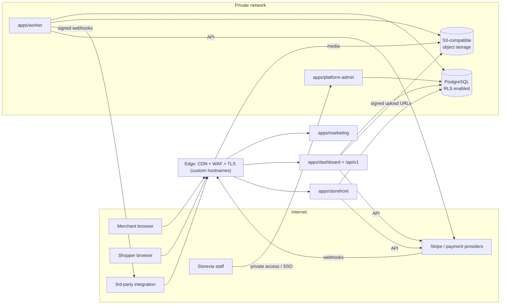
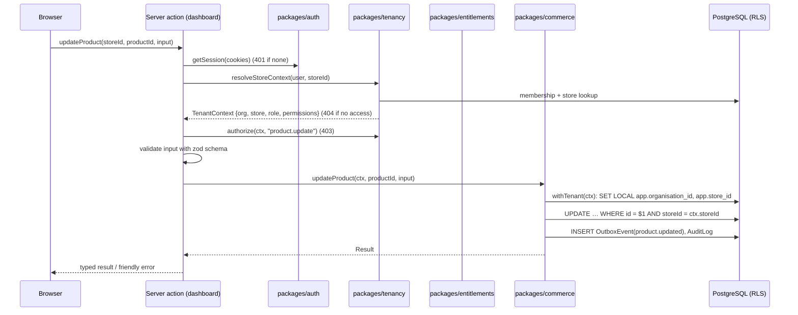

# 01 — System architecture

> Milestone 0 deliverable. Status: **proposed, awaiting review**.

## 1. Goals, in priority order

Security → tenant isolation → data integrity → correctness → extensibility →
performance → user experience → visual polish.

When these conflict, the earlier one wins, and the trade-off is written down in
an ADR.

## 2. Glossary

| Term                      | Meaning                                                                                      |
| ------------------------- | -------------------------------------------------------------------------------------------- |
| **Organisation** (tenant) | A customer of Storevia. Owns stores, members and a subscription. Column: `organisationId`.   |
| **Store**                 | One online store / website inside an organisation. Column: `storeId`.                        |
| **User**                  | A person who signs in to Storevia: merchant staff, or Storevia staff (with `PlatformStaff`). |
| **Member**                | A User with an active `Membership` in an organisation, holding one role.                     |
| **Customer**              | A shopper on a merchant's storefront. Store-scoped. **Never** a User.                        |
| **Platform staff**        | A Storevia employee using the platform-admin surface.                                        |
| **Surface**               | A separately deployed web application (marketing, dashboard, storefront, platform-admin).    |
| **Entitlement**           | What an organisation may do or use, resolved from plan + overrides + usage.                  |
| **Page document**         | The structured JSON tree that is the canonical form of a builder page.                       |

## 3. Surfaces and hostnames

| Surface            | App                                               | Production host                                 | Audience                          | Auth                                                |
| ------------------ | ------------------------------------------------- | ----------------------------------------------- | --------------------------------- | --------------------------------------------------- |
| Marketing site     | `apps/marketing`                                  | `storevia.com`, `www.storevia.com`              | Public                            | None (links to dashboard sign-in)                   |
| Merchant dashboard | `apps/dashboard`                                  | `app.storevia.com`                              | Merchant users                    | Dashboard session cookie (host-only)                |
| Admin REST API     | `apps/dashboard` (route handlers under `/api/v1`) | `api.storevia.com`                              | Merchant integrations, later apps | Bearer API keys / OAuth tokens only, no cookies     |
| Storefront         | `apps/storefront`                                 | `{slug}.storevia.site`, merchant custom domains | Shoppers                          | Cart cookie; customer session later (per host)      |
| Platform admin     | `apps/platform-admin`                             | `admin.storevia.com` (private access)           | Storevia staff                    | Separate platform session realm + MFA/SSO           |
| Worker             | `apps/worker`                                     | none (no inbound HTTP except health)            | —                                 | Service identity                                    |
| User content       | object storage + CDN                              | `media.storeviausercontent.com`                 | Everyone                          | Signed upload URLs; public read for published media |

Why storefronts use a separate registrable domain (`storevia.site`): merchant
content (and later merchant-authored code) is served there, so it must not be
able to read or set cookies for `storevia.com`. `storevia.site` is submitted to
the **Public Suffix List** so one store's subdomain also cannot set cookies for
another store. User-uploaded files are served from a third domain for the same
reason.

## 4. Container view



- All apps are stateless Node.js containers (Next.js `output: "standalone"`),
  horizontally scalable.
- PostgreSQL is the system of record **and** the job queue (ADR-0014).
  Redis is introduced only when a measured need appears (e.g. distributed rate
  limiting at high volume, hot storefront caches).
- The worker runs background jobs: webhook delivery, outbox dispatch,
  image processing, domain verification, billing reconciliation, retention
  purges.

## 5. Layering inside the codebase

```text
apps/*  (Next.js routes, server actions, React UI)
   │  call
   ▼
domain packages  (tenancy, entitlements, billing, commerce, storefront-engine,
                  editor, themes, domains, payments, media, email, analytics)
   │  use
   ▼
foundation packages  (database, validation, security, observability, types, config)
```

Rules (enforced by lint boundaries, see [02-monorepo.md](./02-monorepo.md)):

1. **Business logic lives in domain packages** as plain TypeScript functions:
   `createStore()`, `calculateCart()`, `reserveInventory()`,
   `publishPage()`, `assertFeature()`, `resolveStoreFromHostname()`,
   `createOrder()`. They are testable without React or Next.js.
2. **Apps are thin.** A server action or route handler does
   `authenticate → resolve tenant context → validate input → call domain
service → map result`. No pricing, permission or entitlement logic in React
   components.
3. **Every domain function that touches tenant data takes a `TenantContext`**
   produced by the server, never raw IDs from the client (see
   [03-tenancy.md](./03-tenancy.md)).
4. The browser is never trusted: all totals, permissions, entitlements and
   state transitions are decided server-side.
5. Server-only packages import `server-only` so a secret-bearing module can
   never be bundled for the browser.

## 6. Key request flows

### 6.1 Dashboard mutation (e.g. update a product)



### 6.2 Storefront page request

`host → StoreDomain → Store (status check) → canonical redirect if needed →
published PageVersion + live StoreTheme settings → data bindings resolved in
batch → cached HTML`. Details in [06-storefront.md](./06-storefront.md).

### 6.3 Billing webhook

`signature verify → insert BillingWebhookEvent (unique) → enqueue → worker
re-fetches authoritative object from provider → transactional state update →
entitlement cache version bump → audit`. Details in
[05-billing-entitlements.md](./05-billing-entitlements.md).

## 7. Cross-cutting concerns

| Concern         | Approach                                                                                                                                                                                                                                                                                                                       |
| --------------- | ------------------------------------------------------------------------------------------------------------------------------------------------------------------------------------------------------------------------------------------------------------------------------------------------------------------------------ |
| Validation      | Zod schemas in `packages/validation`, shared by server and client; server always re-validates (ADR-0017)                                                                                                                                                                                                                       |
| Errors          | Domain functions return typed `Result` values for expected failures (`NOT_FOUND`, `FORBIDDEN`, `LIMIT_REACHED`, `CONFLICT`, `VALIDATION`); unexpected errors throw and are caught at the app boundary, logged with the request ID, and shown to the user as a friendly message with that ID. Stack traces never reach clients. |
| Observability   | `packages/observability`: structured JSON logs (pino), request ID propagation (`x-request-id`), OpenTelemetry traces/metrics, error reporting behind an interface. Secrets are redacted by a logger serializer allow-list.                                                                                                     |
| i18n            | UI strings in message catalogues from day one (`next-intl`); dates/numbers/money formatted with `Intl` using the store's locale, currency and timezone. Storage is always UTC and ISO codes.                                                                                                                                   |
| Caching         | Storefront: tag-based caching keyed by store/page/product/theme with invalidation on publish. Dashboard: no shared caching of tenant data; request-scoped memoisation only.                                                                                                                                                    |
| Background work | Transactional outbox + Postgres-backed queue (ADR-0014)                                                                                                                                                                                                                                                                        |
| Feature flags   | Rollout flags (engineering) are separate from entitlements (commercial). Flags live in config/DB; never used for access control.                                                                                                                                                                                               |
| Rate limiting   | Edge (WAF rules) + application limiter keyed by IP, user, API key and store (Postgres-backed at first)                                                                                                                                                                                                                         |
| Accessibility   | WCAG 2.2 AA for dashboard and first-party themes; keyboard-complete editor                                                                                                                                                                                                                                                     |

## 8. Performance principles

- Server Components by default; client components only for interactivity.
- Every list endpoint is paginated (keyset), every query is bounded (`take`
  ≤ 250), and N+1 queries are prevented by batching (storefront data bindings
  are collected and resolved in one pass).
- Storefront HTML is cacheable; cart/checkout are the only dynamic storefront
  routes.
- Images are served as responsive renditions from the CDN.
- Performance budgets are measured in CI (bundle size limits per app) and in
  production (Core Web Vitals, p95 latency per route). Tune after measuring.

## 9. Documents in this set

| #   | Document                                                                                                            |
| --- | ------------------------------------------------------------------------------------------------------------------- |
| 00  | [Repository assessment](./00-repository-assessment.md)                                                              |
| 01  | System architecture (this document)                                                                                 |
| 02  | [Monorepo structure](./02-monorepo.md)                                                                              |
| 03  | [Tenancy strategy](./03-tenancy.md)                                                                                 |
| 04  | [Authentication & RBAC](./04-auth-rbac.md)                                                                          |
| 05  | [Billing & entitlements](./05-billing-entitlements.md)                                                              |
| 06  | [Storefront architecture](./06-storefront.md)                                                                       |
| 07  | [Page-builder document](./07-page-builder-document.md)                                                              |
| 08  | [Theme architecture](./08-themes.md)                                                                                |
| 09  | [Commerce domain](./09-commerce.md)                                                                                 |
| 10  | [API, webhooks and apps](./10-api-webhooks-apps.md)                                                                 |
| —   | [ERD](../database/erd.md) · [Data lifecycle](../database/data-lifecycle.md)                                         |
| —   | [Threat model](../security/threat-model.md)                                                                         |
| —   | [Deployment](../deployment/deployment-architecture.md)                                                              |
| —   | [Roadmap](../roadmap/implementation-roadmap.md) · [Milestones & issues](../roadmap/github-milestones-and-issues.md) |
| —   | [ADRs](../adr/README.md)                                                                                            |
