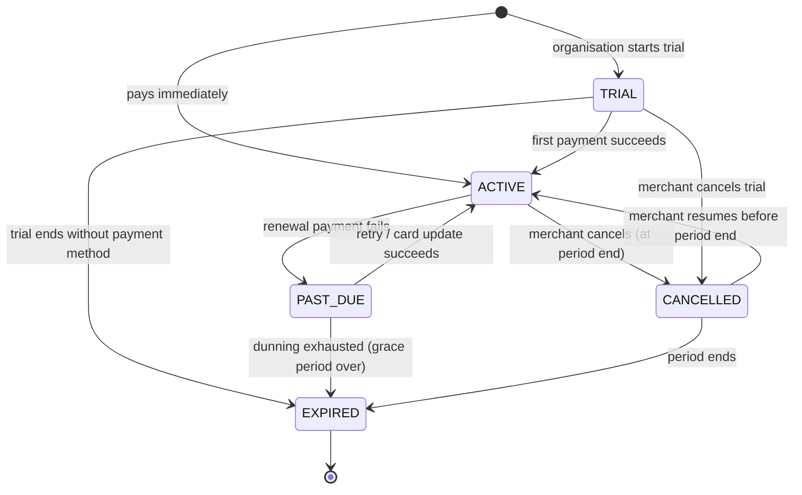

# 05 — Subscription billing and entitlements

> Milestone 0 deliverable. Status: **proposed, awaiting review**. ADR-0009.

Storevia SaaS billing (merchants paying Storevia) and merchant storefront
payments (shoppers paying merchants) are **separate systems** with separate
packages (`billing` vs `payments`), tables, webhooks and credentials.

## 1. Entitlements: the only way to ask "may this organisation…?"

### 1.1 Data

`Plan` → `PlanFeature` ← `Feature`, plus per-organisation
`OrganisationFeatureOverride`, plus `UsageCounter`
([erd.md §3.2](../database/erd.md#32-plans-entitlements-subscriptions)).

`Feature.type`:

| Type      | Meaning                                      | Example                                           |
| --------- | -------------------------------------------- | ------------------------------------------------- |
| `BOOLEAN` | enabled / disabled                           | `custom_domain`, `advanced_builder`, `api_access` |
| `LIMIT`   | enabled + numeric limit (`NULL` = unlimited) | `store_count`, `staff_accounts`, `product_limit`  |
| `CONFIG`  | enabled + structured value                   | `analytics` → `{ "retentionDays": 90 }`           |

Initial feature keys: `store_count`, `staff_accounts`, `product_limit`,
`custom_domain`, `visual_builder`, `advanced_builder`, `premium_themes`,
`analytics`, `discounts`, `abandoned_cart`, `api_access`, `webhooks`,
`custom_code`, `advanced_permissions`, `export`, `priority_support`,
`media_storage` (LIMIT, bytes; introduced with the media library in M3).

Example seed (reference data only; code never reads plan codes):

| Feature               | Starter | Business  | Enterprise            |
| --------------------- | ------- | --------- | --------------------- |
| store_count           | 1       | 3         | override per contract |
| staff_accounts        | 2       | 10        | override              |
| product_limit         | 100     | unlimited | unlimited             |
| custom_domain         | ✔       | ✔         | ✔                     |
| visual_builder        | ✔       | ✔         | ✔                     |
| advanced_builder      | —       | ✔         | ✔                     |
| api_access / webhooks | —       | ✔         | ✔                     |
| custom_code           | —       | —         | ✔                     |

### 1.2 API (`packages/entitlements`)

```ts
type FeatureKey = "store_count" | "staff_accounts" | "product_limit" | /* … */;

getEntitlements(organisationId): Promise<EntitlementSet>          // one query, memoised per request
hasFeature(ctx, key): Promise<boolean>
getFeatureLimit(ctx, key): Promise<bigint | "unlimited" | null>   // null = feature not granted
assertFeature(ctx, key): Promise<void>                            // throws ENTITLEMENT_REQUIRED
getUsage(ctx, key, scope?): Promise<bigint>
canConsume(ctx, key, amount = 1n, scope?): Promise<boolean>
consumeUsage(tx, ctx, key, amount = 1n, scope?): Promise<void>    // atomic check-and-increment, throws LIMIT_REACHED
releaseUsage(tx, ctx, key, amount = 1n, scope?): Promise<void>
```

- `FeatureKey` is a closed union. A test asserts it matches the seeded
  `Feature` rows exactly.
- **Resolution order:** active, unexpired `OrganisationFeatureOverride` →
  `PlanFeature` of the organisation's _entitling_ subscription → **deny**.
  With no entitling subscription, everything resolves to "not granted".
- **Entitling subscription statuses:** `TRIAL`, `ACTIVE`, `PAST_DUE` (during
  the grace period), `CANCELLED` (until `currentPeriodEnd`). `EXPIRED` grants
  nothing.
- `consumeUsage` runs **inside the caller's transaction** that creates the
  resource:

  ```sql
  INSERT INTO "UsageCounter" (...) VALUES (...) ON CONFLICT DO NOTHING;
  SELECT value FROM "UsageCounter" WHERE ... FOR UPDATE;   -- serialises concurrent creators
  -- compare value + amount to the limit; throw LIMIT_REACHED or
  UPDATE "UsageCounter" SET value = value + $amount WHERE ...;
  ```

  Two concurrent "create store" requests can't both slip under a limit of 1.

- A nightly reconciliation job recomputes gauge counters (`store_count`,
  `staff_accounts`, `product_limit`) from source tables, corrects drift and
  emits a metric/alert when drift is found.
- Entitlements are resolved from **our database**, never by calling the
  payment provider on a request path.
- The dashboard receives the resolved `EntitlementSet` to show upgrade
  prompts. **Disabled UI is never the enforcement.** Every gated server path
  calls `assertFeature`/`consumeUsage`.

### 1.3 Downgrades and over-limit states

- A **downgrade pre-check** compares current usage with the target plan. For
  hard resources (stores, staff seats), the downgrade is blocked until usage
  fits, and the UI lists exactly what to reduce. Storevia never auto-deletes
  merchant data to satisfy a limit.
- For soft resources (e.g. `product_limit`), the downgrade is allowed; the
  organisation is marked over-limit, existing items keep working, and new
  creations are blocked until usage is under the limit.
- Boolean features that switch off degrade gracefully: e.g. without
  `custom_domain`, custom domains stop being primary and the store serves on
  its `storevia.site` host (the domain rows are kept, so re-upgrading restores
  them).

## 2. Subscription lifecycle



| Status    | Dashboard                               | Storefront                                                           | Entitlements                                                |
| --------- | --------------------------------------- | -------------------------------------------------------------------- | ----------------------------------------------------------- |
| TRIAL     | full                                    | live (a trial banner may be required on storefronts, TBD by product) | plan features                                               |
| ACTIVE    | full                                    | live                                                                 | plan features                                               |
| PAST_DUE  | full + blocking banner to fix payment   | live                                                                 | plan features during grace period (default 14 days, config) |
| CANCELLED | full until period end, banner to resume | live until period end                                                | plan features until period end                              |
| EXPIRED   | read-only + billing page + data export  | offline ("store unavailable" page, HTTP 503)                         | none                                                        |

After `EXPIRED`, data is retained per [data-lifecycle.md](../database/data-lifecycle.md)
and the organisation can resubscribe at any time within that window.

A new subscription after `EXPIRED` is a **new row** (history is preserved);
at most one non-expired subscription exists per organisation (partial unique
index).

## 3. Billing provider abstraction (`packages/billing`)

```ts
interface BillingProvider {
  readonly id: "stripe" | string;
  ensureCustomer(org: OrganisationBillingProfile): Promise<ProviderCustomerRef>;
  createCheckout(input: {
    organisationId;
    planPriceId;
    trialDays?;
    successUrl;
    cancelUrl;
  }): Promise<{ url: string }>;
  createPortalSession(input: { organisationId; returnUrl }): Promise<{ url: string }>;
  changePlan(input: { subscriptionRef; newPriceRef; prorate: boolean }): Promise<void>;
  cancel(input: { subscriptionRef; atPeriodEnd: boolean }): Promise<void>;
  resume(input: { subscriptionRef }): Promise<void>;
  fetchSubscription(ref): Promise<NormalisedSubscription>;
  fetchInvoices(customerRef, page): Promise<NormalisedInvoice[]>;
  verifyWebhook(rawBody: Buffer, headers: Headers): NormalisedBillingEvent; // throws on bad signature
}
```

- Stripe is the first implementation: Checkout for new subscriptions, the
  Customer Portal for card updates and invoices, Billing for renewal, dunning
  and proration.
- **Regional risk (India):** Stripe availability and RBI e-mandate rules for
  recurring card payments in India may prevent Stripe from being the only
  provider for Indian merchants. The abstraction exists so a second provider
  (e.g. Razorpay Subscriptions) can be added without touching entitlement or
  subscription logic. This needs a business decision before launch in India
  (open question Q3 in the roadmap).
- Monthly and annual prices are separate `PlanPrice` rows. Upgrades take
  effect immediately with proration; downgrades take effect at period end
  (after the pre-check).
- Taxes on Storevia's own invoices (GST/VAT) are handled by the provider's
  tax product or a tax service, configured per launch market.

## 4. Webhook processing

Endpoint: `POST https://app.storevia.com/api/webhooks/billing/stripe`
(route handler, no session, raw body).

1. **Verify the signature** against the raw body using the provider SDK and
   the endpoint secret, with timestamp tolerance (≤ 5 min). If invalid, return
   `400` and log it (no processing, no details echoed).
2. **Record** `INSERT INTO "BillingWebhookEvent" (provider, providerEventId, …) ON CONFLICT DO NOTHING`. If the row already existed with `PROCESSED`,
   return `200` immediately. This insert is the idempotency guarantee.
3. **Enqueue** a `billing.sync` job and return `200` quickly, so the
   provider's timeout is never hit.
4. **Worker** processes the job:
   - Fetches the **current** subscription/invoice object from the provider
     (`fetchSubscription`) instead of trusting the event payload, which
     makes out-of-order delivery harmless.
   - Syncs for one subscription are **serialised** (the job is keyed by the
     subscription and takes a row lock). Each sync re-fetches current
     provider state, so event order doesn't matter. `Subscription.providerSyncedAt`
     records when the applied snapshot was fetched, and a sync whose fetch
     started earlier is discarded. (Stripe objects carry no "updated at"
     field, so the guard uses our fetch time, not a provider timestamp.)
   - In one transaction: upsert `Subscription`, append `SubscriptionEvent`,
     upsert `Invoice`, write `AuditLog`, set the webhook row to `PROCESSED`.
   - On failure, increments `attempts`, stores a sanitised `lastError`, and
     retries with backoff. After N failures it goes to `FAILED` and alerts.
5. A **daily reconciliation job** lists provider subscriptions changed in the
   last 48 hours and syncs them, in case a webhook was lost entirely.

Handled events (Stripe): `checkout.session.completed`,
`customer.subscription.created|updated|deleted|trial_will_end`,
`invoice.finalized|paid|payment_failed|payment_action_required`.
Anything else is recorded as `IGNORED`.

## 5. Tests (Milestone 2)

- Entitlement resolution: override > plan > deny; unlimited; expiry of
  overrides; each subscription status.
- Concurrency: N parallel `consumeUsage` calls against a limit of L create
  exactly L resources.
- Webhooks: invalid signature rejected; duplicate event processed once;
  out-of-order events converge to the provider's final state; a failure and
  retry is idempotent.
- Downgrade pre-check blocks and lists the offending resources.
- Lifecycle transitions produce the documented dashboard/storefront behaviour.
- Plan-code independence: a lint rule bans comparisons against plan `code`
  values outside seeds and platform-admin.
