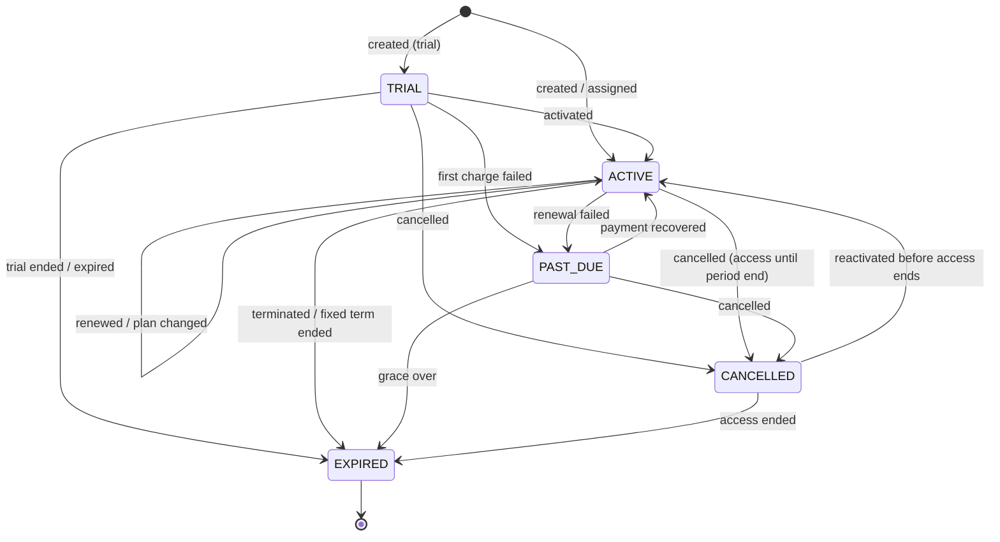

# 05 — Subscription billing and entitlements

> Milestone 0 deliverable, revised for Milestone 2 by
> [ADR-0022](../adr/0022-provider-neutral-subscriptions-and-entitlements.md).
> Status: **approved baseline + ADR-0022**. ADR-0009.

Storevia SaaS billing (merchants paying Storevia) and merchant storefront
payments (shoppers paying merchants) are **separate systems** with separate
packages (`billing` vs `payments`), tables, webhooks and credentials.

## 0. One path for every source

```text
 platform-admin manual action ─┐
 MockBillingProvider event ────┼─► Subscription Service ─► Entitlement Engine ─► Usage Enforcement
 real provider event (later) ──┘   (packages/billing)       (packages/entitlements)  (domain services)
```

- Subscriptions have a **source**: `MANUAL`, `MOCK` or `PAYMENT_PROVIDER`.
  The source records who manages the subscription. It never changes what a
  status means, and no feature reads it.
- **No real payment gateway is integrated in Milestone 2.** Razorpay, Stripe,
  real checkout, the billing portal, stored payment methods and production
  webhooks are deferred to the commercialisation phase. They arrive as
  `BillingProvider` adapters without changes to the domain.
- There are no test-only entitlement bypasses. Tests obtain plans through the
  Subscription Service or real subscription rows, and are then checked by the
  same engine as production.

## 1. Entitlements: the only way to ask "may this organisation…?"

### 1.1 Data

`Plan` → `PlanFeature` ← `Feature`, plus per-organisation
`OrganisationFeatureOverride`, plus `UsageCounter`
([erd.md §3.2](../database/erd.md#32-plans-entitlements-subscriptions)).

`Feature.type` and the value kinds the engine returns:

| Feature type    | Value kinds                               | Example                                           |
| --------------- | ----------------------------------------- | ------------------------------------------------- |
| `BOOLEAN`       | `BOOLEAN` (enabled / disabled)            | `custom_domain`, `advanced_builder`, `api_access` |
| `LIMIT`         | `LIMIT` (numeric, ≥ 0) or `UNLIMITED`     | `store_count`, `staff_accounts`, `product_limit`  |
| `CONFIGURATION` | `CONFIGURATION` (enabled + a JSON object) | `analytics` → `{ "retentionDays": 90 }`           |

A disabled `LIMIT` feature resolves to a limit of 0. "Unlimited" is an
explicit flag, never a missing number. A trigger rejects values that don't fit
the feature type.

Feature keys (inserted by the migration; the `FeatureKey` union must match):
`store_count`, `staff_accounts`, `product_limit`, `custom_domain`,
`visual_builder`, `advanced_builder`, `premium_themes`, `analytics`,
`discounts`, `abandoned_cart`, `api_access`, `webhooks`, `custom_code`,
`advanced_permissions`, `export`, `priority_support`, `media_storage`
(bytes).

- `store_count` counts the organisation's stores that are not archived.
- `staff_accounts` counts **every membership, including the owner**, in any
  status. A suspended member still holds a seat, because they can be
  reactivated.

Plans are reference data loaded by `pnpm db:seed` (idempotent). Code never
reads plan keys.

| Feature               | System default | Starter | Business  | Enterprise |
| --------------------- | -------------- | ------- | --------- | ---------- |
| store_count           | 1              | 1       | 3         | 10         |
| staff_accounts        | 1 (owner)      | 2       | 10        | 50         |
| product_limit         | 25             | 100     | unlimited | unlimited  |
| custom_domain         | —              | ✔       | ✔         | ✔          |
| visual_builder        | ✔              | ✔       | ✔         | ✔          |
| advanced_builder      | —              | —       | ✔         | ✔          |
| api_access / webhooks | —              | —       | ✔         | ✔          |
| custom_code           | —              | —       | —         | ✔          |
| analytics             | —              | 30 days | 365 days  | 730 days   |

Enterprise contracts that need more use **overrides**, never an ad-hoc plan.

### 1.2 API (`packages/entitlements`, server-only)

```ts
type FeatureKey = "store_count" | "staff_accounts" | "product_limit" | /* … */;

loadEntitlements(tx, organisationId, now?): Promise<EntitlementSet>   // one round trip
hasFeature(tx, organisationId, key): Promise<boolean>
assertFeature(tx, organisationId, key): Promise<void>                // throws ENTITLEMENT_REQUIRED
getFeatureLimit(tx, organisationId, key): Promise<bigint | "unlimited">
getUsage(tx, organisationId, key, scope?): Promise<bigint>
canConsume(tx, organisationId, key, amount = 1n, scope?): Promise<boolean>
consumeUsage(tx, organisationId, key, amount = 1n, scope?): Promise<void> // atomic, throws LIMIT_REACHED
releaseUsage(tx, organisationId, key, amount = 1n, scope?): Promise<void>
```

- `tx` is the caller's transaction: `withTenant` (RLS-scoped to the
  organisation) for merchant paths, or the platform/system connection for staff
  and webhook paths. The organisation ID always comes from a trusted
  `TenantContext` (`scopeOf`), never from a request.
- **Resolution precedence, per feature:**
  1. an unexpired `OrganisationFeatureOverride` (a complete replacement value);
  2. the `PlanFeature` of the organisation's **entitling** subscription;
  3. the feature's **system default**.
- **Entitling subscription:** see §2.1. It is decided by one time-aware
  function that doesn't read `source`.
- `consumeUsage` runs **inside the transaction** that creates the resource:

  ```sql
  INSERT INTO "UsageCounter" (...) VALUES (...) ON CONFLICT DO NOTHING;
  SELECT value FROM "UsageCounter" WHERE ... FOR UPDATE;   -- serialises concurrent creators
  -- compare value + amount to the resolved limit; throw LIMIT_REACHED or
  UPDATE "UsageCounter" SET value = value + $amount WHERE ...;
  ```

  Two concurrent "create store" requests can't both slip under a limit of 1.

- Gauge counters were backfilled by the migration. `reconcileUsage`
  recomputes `store_count` and `staff_accounts` from their source tables and
  reports drift. Staff can run it for an organisation, and the worker (M3)
  will run it nightly.
- Entitlements are resolved from **our database**, never by calling a payment
  provider on a request path. They are not cached across requests (ADR-0022
  §9). `onEntitlementsChanged(organisationId)` runs after every change and is
  the single invalidation hook.
- The dashboard shows the resolved set. **Disabled UI is never the
  enforcement.** Every gated server path calls `assertFeature`/`consumeUsage`.

### 1.3 Downgrades and over-limit states

Storevia **never deletes or disables merchant data because of a plan change,
expiry or override removal**. Over-limit is **computed** (usage > limit), not
stored. While an organisation is over a limit, **existing resources keep
working and new creation is blocked** with `LIMIT_REACHED` until usage fits.
Staff see an over-limit pre-check before a manual downgrade and must
acknowledge it. Provider-side downgrades are applied and then flagged.

| Resource                      | Feature                   | While over the limit                                                                                                                                  | Enforced from    |
| ----------------------------- | ------------------------- | ----------------------------------------------------------------------------------------------------------------------------------------------------- | ---------------- |
| Stores                        | `store_count`             | All stores keep working (dashboard, storefront). Creating a store is blocked. Archiving frees a slot                                                  | M2 ✔             |
| Staff (memberships)           | `staff_accounts`          | Every member keeps access. Invitations can't be sent and acceptances fail. Removing members frees seats                                               | M2 ✔             |
| Products                      | `product_limit`           | Existing products stay editable and purchasable. New products (and un-archiving) are blocked                                                          | M3               |
| Media storage                 | `media_storage`           | Existing media is served. New uploads are blocked. Deleting media frees space                                                                         | M3               |
| Inventory locations           | (future limit)            | Existing locations keep stock and fulfilment. Creating locations is blocked                                                                           | M3 (if limited)  |
| API usage                     | `api_access`, rate quotas | Without `api_access`, keys stop authenticating (the keys are kept, so re-enabling restores them). Over a metered quota: `429` until the period resets | M8               |
| Boolean features switched off | e.g. `custom_domain`      | Degrades gracefully: custom domains stop being primary and the store serves on its `storevia.site` host. Rows are kept, so re-enabling restores them  | with the feature |

## 2. Subscription lifecycle

### 2.1 States and the entitlement rule

| Status      | Grants entitlements while                   | Dashboard                           | Storefront                                   |
| ----------- | ------------------------------------------- | ----------------------------------- | -------------------------------------------- |
| `TRIAL`     | `now < trialEndsAt`                         | full                                | live                                         |
| `ACTIVE`    | `expiresAt` is null or `now < expiresAt`    | full                                | live                                         |
| `PAST_DUE`  | `now < graceEndsAt` (default grace 14 days) | full + banner                       | live                                         |
| `CANCELLED` | `now < expiresAt` (access end)              | full until access ends, banner      | live until access ends                       |
| `EXPIRED`   | never                                       | system-default floor + billing page | per system default (storefront policy in M4) |

Without an entitling subscription, organisations fall back to the system
defaults (§1.1). Because the rule is time-aware, a late expiry sweep can never
extend access. `sweepSubscriptionExpiry` (run with `pnpm billing:sweep`, and by
the worker from M3) moves due subscriptions to `EXPIRED` through the
Subscription Service, so the history is complete.

A new subscription after `EXPIRED` is a **new row** (history is preserved);
at most one non-expired subscription exists per organisation (partial unique
index).

### 2.2 Transitions (source-independent, enforced by the Subscription Service)



Every other transition (for example `EXPIRED → ACTIVE` or `CANCELLED → TRIAL`)
is rejected. Each applied change appends a `SubscriptionEvent` and an
`AuditLog` row in the same transaction. The table is covered by
`packages/billing/src/state-machine.test.ts`.

### 2.3 Who changes what

| Source             | Changed by                                                         | Notes                                                                                      |
| ------------------ | ------------------------------------------------------------------ | ------------------------------------------------------------------------------------------ |
| `MANUAL`           | Platform staff in platform-admin (§5)                              | Provider events never edit a manual subscription                                           |
| `MOCK`             | `MockBillingProvider` events through the webhook pipeline (§4, §6) | Non-production only                                                                        |
| `PAYMENT_PROVIDER` | Provider events through the same pipeline (later)                  | Staff act through the adapter (`cancelSubscription`, …); the result comes back as an event |

A provider-created subscription for an organisation that already has a live
subscription **supersedes** it: the old one becomes `EXPIRED` (event
`superseded`) in the same transaction. This is how a manual trial will convert
to a paid provider subscription.

## 3. Billing provider abstraction (`packages/billing`)

```ts
interface BillingProvider {
  readonly key: BillingProviderKey; // MOCK | RAZORPAY | STRIPE
  createCustomer(input: { organisationId; email?; name }): Promise<{ customerRef: string }>;
  createCheckout(input: { customerRef; planKey; interval; returnUrl }): Promise<CheckoutResult>;
  createSubscription(input: {
    customerRef;
    planKey;
    interval;
    trialDays?;
  }): Promise<ProviderSubscriptionSnapshot>;
  changeSubscription(input: {
    subscriptionRef;
    planKey;
    interval?;
  }): Promise<ProviderSubscriptionSnapshot>;
  cancelSubscription(input: {
    subscriptionRef;
    atPeriodEnd: boolean;
  }): Promise<ProviderSubscriptionSnapshot>;
  reactivateSubscription(input: { subscriptionRef }): Promise<ProviderSubscriptionSnapshot>;
  getSubscription(subscriptionRef: string): Promise<ProviderSubscriptionSnapshot | null>;
  verifyWebhook(rawBody: string, headers: Headers, now?: Date): void; // throws on bad/stale signature
  parseWebhookEvent(rawBody: string): NormalisedBillingEvent; // throws on invalid schema
}
```

- A `ProviderSubscriptionSnapshot` is provider-neutral: status, plan key,
  interval, period, trial, cancellation and grace dates, customer and
  subscription references. A `NormalisedBillingEvent` carries the event ID,
  type, occurrence time, a snapshot and its **version**.
- `MockBillingProvider` is the only provider in Milestone 2 (§6).
- **Regional risk (India):** Stripe availability and RBI e-mandate rules may
  prevent Stripe from being the only provider for Indian merchants. Razorpay
  Subscriptions and Stripe are both adapter candidates. Open question Q3 in
  the roadmap still needs a business decision.
- Monthly and annual list prices are separate provider-neutral `PlanPrice`
  rows. Provider price IDs go in `PlanPriceProviderRef` with the first adapter.
- Taxes on Storevia's own invoices (GST/VAT) are handled by the provider's
  tax product or a tax service, configured per launch market.

## 4. Webhook pipeline (every provider, including the mock)

Endpoint: `POST /api/webhooks/billing/{provider}` on the dashboard host. It is
a route handler with no session and a raw body. It returns **404 for providers
that are not enabled** in this environment. In Milestone 2 only `mock` can be
enabled, and never in production.

`ingestBillingWebhook(providerKey, rawBody, headers)`:

1. **Verify** the signature over the raw body, with a 5-minute timestamp
   tolerance. Invalid or stale (replayed) signatures return `400` and are
   logged. Nothing is recorded or processed, and no details are echoed.
2. **Parse** and validate the payload schema. If it's invalid, return `400`
   (logged, nothing recorded).
3. **Record** it with `INSERT INTO "BillingWebhookEvent" … ON CONFLICT DO NOTHING`.
   If the row already exists and is `PROCESSED`/`IGNORED`, return `200`
   (`duplicate`). This insert is the idempotency guarantee.
4. **Apply** it in one transaction under a transaction-scoped advisory lock on
   the provider subscription ID (so syncs for one subscription are
   serialised):
   - Match the customer through `BillingCustomer`. If it's unknown, mark the
     event `IGNORED (unknown_subscription)`.
   - If the snapshot version ≤ `Subscription.providerSyncedAt`, mark it
     `IGNORED (stale)`. Out-of-order delivery converges to the newest state.
   - Reject illegal transitions with `IGNORED (illegal_transition)` and log a
     warning.
   - Otherwise call the Subscription Service. It writes `Subscription`,
     `SubscriptionEvent` and `AuditLog` (`actorType = SYSTEM`), and the ledger
     row becomes `PROCESSED`.
5. On an unexpected error, increment `attempts`, store a sanitised
   `lastError`, mark the row `FAILED` and return `500`, so the provider
   retries. A retry of the same event ID reprocesses it idempotently.

Adapters that re-fetch state (planned for Stripe) set the snapshot version to
the fetch time. Adapters that push snapshots use the event time. The pipeline
treats both the same way.

In Milestone 2, processing runs inline. When the worker exists (M3), step 4
becomes a job with retries and backoff, the daily provider reconciliation job
is added, and the contract doesn't change.

## 5. Manual assignment (platform-admin only)

Staff manage `MANUAL` subscriptions and overrides in the platform-admin app
(`admin.storevia.com`: separate realm, `PlatformStaff` gate). Merchant roles,
including `OWNER`, have **no path** to assign or change plans. The dashboard
billing page is informational.

| Operation                           | Platform permission                    | Allowed from                     |
| ----------------------------------- | -------------------------------------- | -------------------------------- |
| Assign plan (new subscription)      | `platform.subscription.manage`         | no live subscription             |
| Start trial                         | `platform.subscription.manage`         | no live subscription             |
| Change plan / interval / expiry     | `platform.subscription.manage`         | live `MANUAL` subscription       |
| Activate                            | `platform.subscription.manage`         | `TRIAL`, `PAST_DUE`, `CANCELLED` |
| Cancel (access until a chosen date) | `platform.subscription.manage`         | `TRIAL`, `ACTIVE`, `PAST_DUE`    |
| Expire now                          | `platform.subscription.manage`         | any live `MANUAL` subscription   |
| Add / change / remove override      | `platform.entitlement_override.manage` | any organisation                 |
| Recalculate usage                   | `platform.subscription.manage`         | any organisation                 |
| Simulate mock provider events       | `platform.billing.simulate` + env gate | non-production only (§6)         |

Platform roles: `SUPER_ADMIN` and `BILLING` hold the manage permissions.
`OPERATIONS`, `SUPPORT` and `READ_ONLY` can read. `OPERATIONS` may also
simulate outside production.

Every manual operation requires:

1. an authenticated platform-realm session and an active `PlatformStaff` row;
2. the platform permission above;
3. **step-up authentication** within the last 10 minutes (password
   re-confirmation);
4. a **reason** (3–500 characters), plus optional internal notes (visible
   to staff only);
5. an `AuditLog` row (`actorType = PLATFORM_STAFF`, organisation, action,
   target, reason, safe before/after values, request ID, IP, user agent);
6. a `SubscriptionEvent` (for subscription changes);
7. `onEntitlementsChanged(organisationId)` after commit.

Steps 5 and 6 are written in the same transaction as the change.

Manual fields: plan, status (`TRIAL` or `ACTIVE` on assignment), billing
interval (monthly, annual or none), trial start and end, subscription start
(not in the future), optional fixed expiry (auto-expire) or no expiry, reason
and notes.

## 6. Mock billing and environment safety

- `MockBillingProvider` implements `BillingProvider`. The platform-admin
  simulation panel asks it for signed events. Supported events:
  `subscription.created`, `activated`, `renewed`, `upgraded`, `downgraded`,
  `past_due`, `payment_recovered`, `cancelled`, `expired`, and the faults
  duplicate, replayed (stale signature), out-of-order (older snapshot),
  invalid signature, invalid schema and unknown subscription. It delivers
  every event to `ingestBillingWebhook`, the pipeline in §4. **The simulator
  never writes subscription or entitlement state.**
- The provider registry enables the mock only when `STOREVIA_ENV` is
  `development` or `test`, or `staging` with `BILLING_MOCK_ENABLED=true`. It
  can't be enabled in `preview` or `production`. When the mock is disabled,
  the simulation page, its server actions and the mock webhook route all
  answer 404 (a server-side check, not hidden UI).
- `MOCK_BILLING_WEBHOOK_SECRET` signs mock events. It isn't a payment secret,
  but it is still never logged or committed.

## 7. Merchant billing page (dashboard)

`/o/{org}/billing`, permission `billing.read` (Owner and Admin). It is
**informational only**:

- current plan, status, source label ("Managed by Storevia" for manual,
  "Test billing" for mock), interval, trial end, access end or renewal;
- usage against limits for `store_count` and `staff_accounts`, with
  over-limit warnings;
- the features included.

When no real payment provider is configured, the page shows **no payment,
checkout, upgrade or invoice controls**. A clearly labelled "Online payments
aren't available yet" region is reserved and doesn't pretend to work. Plan
changes are requested from Storevia (contact text, no fake button).

## 8. Tests (Milestone 2)

- Resolution: override > plan > system default; unlimited; disabled limit =
  0; override expiry and removal; each subscription status and the time-aware
  rule (trial end, grace end, access end, fixed expiry).
- State machine: every legal and illegal transition, for every source.
- Concurrency: N parallel store creations against a limit L create exactly L.
- Enforcement: `store_count` and `staff_accounts` can't be bypassed by forged
  IDs, crafted Server Action requests, concurrent requests, or invitations
  sent before a downgrade.
- Merchants (including Owners and Admins) can't change plans: no dashboard
  path exists, and the database role can't write subscriptions or overrides.
- Platform admin: permission matrix, step-up required, reason required,
  audit and event rows written, merchant sessions rejected.
- Pipeline: invalid signature, stale timestamp (replay), invalid schema,
  duplicate event (processed once), out-of-order events (converge), unknown
  subscription, illegal transition, failure then retry.
- Environment safety: the mock provider and simulation are unavailable in
  production.
- Over-limit: a downgrade keeps every resource and blocks new creation.
- Plan-key independence: a lint rule bans plan-key comparisons outside seeds
  and platform-admin.
- Every Milestone 1 tenant-isolation and security test keeps running.
