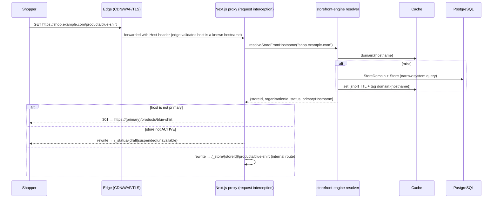

# 06 — Storefront architecture

> Milestone 0 deliverable. Status: **approved baseline (Milestone 0, 2026-09-24)**. ADR-0013.

## 1. One engine, every store

`apps/storefront` is a single multi-tenant Next.js application. No per-merchant
build, deployment or code generation. Each request is resolved as:

```text
hostname → StoreDomain → Store → live StoreTheme (+ ThemeVersion) → route → Page / template → PageDocument → render tree
```

## 2. Request pipeline



- **Hostname normalisation** (`packages/domains`): lower-case, strip port and
  trailing dot, IDNA → punycode, reject IP literals and anything not matching
  hostname syntax. Unknown hosts get a generic 404 page with no store data.
- The internal `/_store/{storeId}/…` segment is **not reachable directly**:
  the proxy strips any incoming path starting with `/_store` or `/_status`, so
  a shopper can't pick a different store by path.
- **Canonical host:** each store has one `isPrimary` domain. All other active
  domains (including the `storevia.site` subdomain once a custom domain is
  primary) redirect `301` to it, preserving path and query. Redirect targets
  come only from `StoreDomain` rows, never from request input, so there is no
  open redirect.
- **Store status:** `ACTIVE` → serve; `DRAFT` → "coming soon" page (the
  merchant previews with a signed preview token); `SUSPENDED` → unavailable
  page; `ARCHIVED` or subscription `EXPIRED` → 503 unavailable page.

## 3. Routes

| Route                         | Content source                                                 | Cache                                              |
| ----------------------------- | -------------------------------------------------------------- | -------------------------------------------------- |
| `/`                           | `Page(kind=HOME)`                                              | cached, tags `store`, `page`, `theme`, `nav`       |
| `/pages/{handle}`             | `Page(kind=STANDARD)`                                          | cached                                             |
| `/products/{handle}`          | `Page(kind=PRODUCT_TEMPLATE)` + product data                   | cached, + `product:{id}`                           |
| `/collections/{handle}`       | `Page(kind=COLLECTION_TEMPLATE)` + collection data (paginated) | cached, + `collection:{id}`                        |
| `/search?q=`                  | `Page(kind=SEARCH_TEMPLATE)` + search results                  | short TTL, cache key includes the normalised query |
| `/cart`                       | Storevia cart component (theme-styled)                         | dynamic, `private, no-store`                       |
| `/checkout/{token}`           | Storevia checkout (restricted styling)                         | dynamic, `no-store`                                |
| `/account/*` (after M6)       | customer pages                                                 | dynamic                                            |
| `/sitemap.xml`, `/robots.txt` | generated per store                                            | cached                                             |
| anything else                 | `Page(kind=NOT_FOUND)` with status 404                         | cached                                             |

Routes are Storevia-defined. Merchants control page content and handles, not
the routing table. Products, collections and pages use typed references
(ADR-0012), so renaming a handle can add a redirect row (M4 follow-up) without
breaking navigation.

## 4. Rendering

1. Load the published `PageVersion.document` (via `Page.publishedVersionId`)
   and the live `StoreTheme.publishedSettings`.
2. **Upgrade** the document to the current schema version in memory if needed
   ([07-page-builder-document.md](./07-page-builder-document.md) §7).
3. **Collect data bindings**: walk the tree once and gather every data
   requirement (`ProductGrid` → collection X, limit 8; `Product` → current
   product; `Navigation` → menu "main-menu").
4. **Resolve in batch**: one query per binding type (e.g. all products for
   all grids in one `WHERE id = ANY($1)`), never per node, so no N+1.
5. **Render** with React Server Components using the component registry's
   renderers. Only interactive leaves (add-to-cart, variant picker, cart
   drawer, search box) are client components.
6. Design tokens from theme settings are emitted once as CSS custom properties
   on `:root` (`--sv-color-primary`, …); node styles compile to scoped classes.

All storefront data access goes through `@storevia/commerce/storefront`
read models, which return **public DTOs** (explicit field selection: no cost
price, no inventory counts beyond an availability flag, no internal notes) and
only `ACTIVE`, published, non-deleted records.

## 5. Caching and invalidation

- Cached rendering with **cache tags**: `store:{id}`, `page:{id}`,
  `product:{id}`, `collection:{id}`, `theme:{storeThemeId}`, `nav:{id}`,
  `domain:{hostname}`.
- Invalidation is **event-driven**: `publishPage()`, product updates, theme
  publish, navigation save and domain changes write `OutboxEvent`s; the
  worker calls the revalidation endpoint (authenticated with a service
  token) and purges the CDN by tag where supported.
- The edge CDN caches storefront HTML for short periods
  (`s-maxage=60, stale-while-revalidate=600`) only for anonymous requests
  without a cart/customer cookie that affects the page. Cart state is
  fetched client-side or rendered only on dynamic routes, so product pages
  stay cacheable.
- Cache keys never include user input except normalised, bounded values
  (search query, page number), to prevent cache poisoning and key
  explosion.

## 6. Cart

- Cart identity: an opaque 256-bit token in a host-only cookie
  `__Host-sv_cart` (`Secure`, `HttpOnly`, `SameSite=Lax`); the DB stores its
  hash.
- Cart mutations are server actions on the storefront. They validate the
  variant belongs to **this** store, is `ACTIVE` and purchasable, and clamp
  quantities.
- Cart prices shown to the shopper come from `calculateCart()` on the server.
  The cart table holds no prices.

## 7. Checkout

Checkout belongs to the commerce engine, not the page builder
([09-commerce.md](./09-commerce.md) §5). It is rendered on the store's own host
(`/checkout/{token}`) so custom-domain stores keep their domain. The builder
can style it only within permitted boundaries: logo, colours and fonts from
theme tokens, and a few content slots. It cannot add arbitrary components or
scripts to checkout.

## 8. Preview

The dashboard requests a **preview token** (signed, 15 min, bound to
`storeId` + `pageVersionId` or `storeThemeId`). The storefront renders the
draft with `Cache-Control: no-store`, `X-Robots-Tag: noindex` and a preview
banner. Preview tokens never grant access to other stores or to admin data.

## 9. Security

- The storefront has **no merchant-admin endpoints**. It imports only read
  models and shopper actions (cart, checkout, customer account).
- Strict CSP with nonces. Merchant `CustomHTML` is rendered in a sandboxed
  iframe (`sandbox` without `allow-same-origin`) or sanitised; see
  [07-page-builder-document.md](./07-page-builder-document.md) §8.
- Per-IP and per-store rate limits on cart, checkout, search and customer
  auth endpoints.
- SEO: canonical URLs point at the primary domain; draft/preview/password
  pages are `noindex`.

## 10. Performance budget (initial)

| Metric                              | Budget                                               |
| ----------------------------------- | ---------------------------------------------------- |
| Cached HTML TTFB (edge hit)         | < 100 ms p75                                         |
| Uncached render (origin)            | < 500 ms p95                                         |
| JS shipped on a product page        | < 90 kB gzip (excluding images)                      |
| LCP (4G, mid-range phone)           | < 2.5 s p75                                          |
| DB queries per uncached page render | ≤ 8 (enforced by a test harness that counts queries) |
