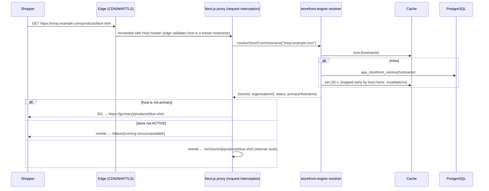

# 06 — Storefront architecture

> Milestone 0 deliverable. Status: **approved baseline (Milestone 0, 2026-09-24)**. ADR-0013, refined for Milestone 4 by ADR-0028.
>
> **Implemented in Milestone 4** (`apps/storefront`, `packages/domains`,
> `@storevia/commerce/storefront`, `packages/editor`). Where M4 differs from
> the baseline below, the section says so in an "M4" note; ADR-0028 records
> why.

## 1. One engine, every store

`apps/storefront` is a single multi-tenant Next.js application. No per-merchant
build, deployment or code generation. Each request is resolved as:

```text
hostname → StoreDomain → Store → live StoreTheme (+ ThemeVersion) → route → Page / template → PageDocument → render tree
```

## 2. Request pipeline



- **Hostname normalisation** (`packages/domains`): lower-case, strip port and
  trailing dot, IDNA → punycode, reject IP literals and anything not matching
  hostname syntax. Unknown hosts get a generic 404 page with no store data.
- The internal `/sv/{storeId}/…` segment is **not reachable directly**:
  the proxy prefixes **every** path with the resolved store, so a request
  for `/sv/{other}/…` becomes `/sv/{this}/sv/{other}/…` and 404s, and the
  store layout also checks a signed header set by the proxy (ADR-0028 §4).
- **Canonical host:** each store has one `isPrimary` domain. All other active
  domains (including the `storevia.site` subdomain once a custom domain is
  primary) redirect `301` to it, preserving path and query. Redirect targets
  come only from `StoreDomain` rows, never from request input, so there is no
  open redirect.
- **Store status:** `ACTIVE` → serve; `DRAFT` → "coming soon" page (the
  merchant previews with a signed preview token); `SUSPENDED` (store or
  organisation), `ARCHIVED` or an organisation pending deletion → 503
  unavailable page. The subscription status is not consulted: an expired
  subscription falls back to the system-default floor (ADR-0028 §3).
- **M4:** the status pages are `/status/coming-soon` (`200`, `noindex`)
  and `/status/unavailable` (`503`, `noindex`); neither shows
  store data beyond its name. Unknown hosts get a generic `404` built in the
  proxy.
- **Database access:** the storefront connects as `storevia_storefront`,
  resolves hosts through one narrow `SECURITY DEFINER` function, and reads
  everything else under restrictive, sellable-only row policies and column
  grants (ADR-0028 §2).

## 3. Routes

| Route                         | Content source                                                 | Cache                                              |
| ----------------------------- | -------------------------------------------------------------- | -------------------------------------------------- |
| `/`                           | `Page(kind=HOME)`                                              | cached, tags `store`, `page`, `theme`, `nav`       |
| `/pages/{handle}`             | `Page(kind=STANDARD)`                                          | cached                                             |
| `/products/{handle}`          | `Page(kind=PRODUCT_TEMPLATE)` + product data                   | cached, + `product:{id}`                           |
| `/collections/{handle}`       | `Page(kind=COLLECTION_TEMPLATE)` + collection data (paginated) | cached, + `collection:{id}`                        |
| `/search?q=`                  | `Page(kind=SEARCH_TEMPLATE)` + search results                  | short TTL, cache key includes the normalised query |
| `/cart`                       | Storevia cart component (theme-styled)                         | dynamic, `private, no-store`                       |
| `/checkout/{token}`           | Storevia checkout (restricted styling)                         | dynamic, `no-store`                                |
| `/account/*` (after M6)       | customer pages                                                 | dynamic                                            |
| `/sitemap.xml`, `/robots.txt` | generated per store                                            | cached                                             |
| anything else                 | `Page(kind=NOT_FOUND)` with status 404                         | cached                                             |

**M4:** checkout and customer accounts arrive with M6. The cache column is
the baseline design; M4 caches page data in process under the tags in §5
(`store`, `catalogue`, `product`, `pages`, `host`), and `/search` results
are cached by the normalised query and page. `/cart` and cart actions are
dynamic and `private, no-store`.

Routes are Storevia-defined. Merchants control page content and handles, not
the routing table. Products, collections and pages use typed references
(ADR-0012), so renaming a handle can add a redirect row (M4 follow-up) without
breaking navigation.

## 4. Rendering

1. Load the published `PageVersion.document` (via `Page.publishedVersionId`)
   and the live `StoreTheme.publishedSettings`.
2. **Upgrade** the document to the current schema version in memory if needed
   ([07-page-builder-document.md](./07-page-builder-document.md) §7).
3. **Collect data bindings**: walk the tree once and gather every data
   requirement (`ProductGrid` → collection X, limit 8; `Product` → current
   product; `Navigation` → menu "main-menu").
4. **Resolve in batch**: one query per binding type (e.g. all products for
   all grids in one `WHERE id = ANY($1)`), never per node, so no N+1.
5. **Render** with React Server Components using the component registry's
   renderers. Only interactive leaves (add-to-cart, variant picker, cart
   drawer, search box) are client components.
6. Design tokens from theme settings are emitted once as CSS custom properties
   on `:root` (`--sv-color-primary`, …); node styles compile to scoped classes.

**M4:** stores render from Storevia's default page documents and a fixed
default theme (ADR-0028 §6); M5 lets merchants publish pages over them and
M7 adds store themes. There are **no client components** on store pages:
add to cart, quantity changes and search are HTML forms posting to server
actions or `GET` routes, so they work without JavaScript. The only client
module is the error boundary Next.js requires, guarded by a unit test (§10).

All storefront data access goes through `@storevia/commerce/storefront`
read models, which return **public DTOs** (explicit field selection: no cost
price, no inventory counts beyond an availability flag, no internal notes) and
only `ACTIVE`, published, non-deleted records.

## 5. Caching and invalidation

- Cached rendering with **cache tags**: `store:{id}`, `page:{id}`,
  `product:{id}`, `collection:{id}`, `theme:{storeThemeId}`, `nav:{id}`,
  `domain:{hostname}`.
- Invalidation is **event-driven**: `publishPage()`, product updates, theme
  publish, navigation save and domain changes write `OutboxEvent`s; the
  worker calls the revalidation endpoint (authenticated with a service
  token) and purges the CDN by tag where supported.
- The edge CDN caches storefront HTML for short periods
  (`s-maxage=60, stale-while-revalidate=600`) only for anonymous requests
  without a cart/customer cookie that affects the page. Cart state is
  fetched client-side or rendered only on dynamic routes, so product pages
  stay cacheable.
- Cache keys never include user input except normalised, bounded values
  (search query, page number), to prevent cache poisoning and key
  explosion.

**M4 implementation** (ADR-0028 §9):

- Pages render dynamically (so `404` and `503` are real status codes), over
  an in-process **tag-indexed data cache**: single-flight loads, an LRU
  bound of 5,000 entries and a 5-minute TTL as a safety net. Tags are
  `store:{id}`, `catalogue:{storeId}`, `product:{id}`, `pages:{storeId}` and
  `host:{hostname}`; `@storevia/domains` maps each outbox event to its tags
  for both the worker and the storefront.
- Outbox events are written by **database triggers** on every table a
  shopper can see (catalogue, availability-changing stock movements,
  pages, store, domains, organisation status), in the same transaction as
  the change. The worker's `storefront.outbox-dispatch` job posts the tags
  every 15 seconds to `/api/internal/revalidate`, signed with
  `STOREFRONT_REVALIDATE_SECRET` over a timestamp and the body.
- The cache is per process: running more than one storefront instance
  needs the invalidation fanned out to every instance or a shared cache
  handler. Edge caching and CDN purge by tag are M8.

## 6. Cart

- Cart identity: an opaque 256-bit token in a host-only cookie
  `__Host-sv_cart` (`Secure`, `HttpOnly`, `SameSite=Lax`); the DB stores its
  SHA-256. Plain-HTTP development uses `sv_cart` without `Secure`.
- **M4:** carts expire 30 days after their last change and hold at most 50
  lines of 1–99 each. Mutations are rate limited per client address and
  per cart. Stock is checked but not reserved (reservations are M6). The
  cart page shows lines whose product stopped being sellable as
  unavailable and leaves them out of the subtotal.
- Cart mutations are server actions on the storefront. They validate the
  variant belongs to **this** store, is `ACTIVE` and purchasable, and clamp
  quantities.
- Cart prices shown to the shopper come from `calculateCart()` on the server.
  The cart table holds no prices.

## 7. Checkout

Checkout belongs to the commerce engine, not the page builder
([09-commerce.md](./09-commerce.md) §5). It is rendered on the store's own host
(`/checkout/{token}`) so custom-domain stores keep their domain. The builder
can style it only within permitted boundaries: logo, colours and fonts from
theme tokens, and a few content slots. It cannot add arbitrary components or
scripts to checkout.

## 8. Preview

The dashboard requests a **preview token** (signed, 15 min, bound to
`storeId` + `pageVersionId` or `storeThemeId`). The storefront renders the
draft with `Cache-Control: no-store`, `X-Robots-Tag: noindex` and a preview
banner. Preview tokens never grant access to other stores or to admin data.

**M4:** the only scope is `store` (see a "coming soon" store as it will
look live). Store settings → Storefront → "Preview storefront" (needs
`design.edit`) opens `https://{primary}/?preview={token}`; the proxy
verifies the token against the resolved store, moves it into a host-only
`HttpOnly` cookie (`__Host-sv_preview`) that expires with it, and
redirects to the same URL without the token, with `Referrer-Policy:
no-referrer`. `page-version` (M5) and `store-theme` (M7) scopes reuse the
format.

## 9. Security

- The storefront has **no merchant-admin endpoints**. It imports only read
  models and shopper actions (cart, checkout, customer account).
- Strict CSP with nonces. Merchant `CustomHTML` is rendered in a sandboxed
  iframe (`sandbox` without `allow-same-origin`) or sanitised; see
  [07-page-builder-document.md](./07-page-builder-document.md) §8.
- Per-IP and per-store rate limits on cart, checkout, search and customer
  auth endpoints.
- SEO: canonical URLs point at the primary domain; draft/preview/password
  pages are `noindex`.

## 10. Performance budget

| Metric                              | Budget                                               | M4 status                                                                                                                              |
| ----------------------------------- | ---------------------------------------------------- | -------------------------------------------------------------------------------------------------------------------------------------- |
| Cached HTML TTFB (edge hit)         | < 100 ms p75                                         | no edge yet (M8). Origin with warm data cache: 12–40 ms (local)                                                                        |
| Uncached render (origin)            | < 500 ms p95                                         | 27–69 ms after the process warmed up; the first request after a start took 573 ms (local)                                              |
| JS shipped on a product page        | < 90 kB gzip (excluding images)                      | **not met: about 173 kB gzip**, all of it the Next.js App Router runtime (React DOM, router). 0 kB of application code (see below)     |
| LCP (4G, mid-range phone)           | < 2.5 s p75                                          | not measured; needs field data on real hosting (M8)                                                                                    |
| DB queries per uncached page render | ≤ 8 (enforced by a test harness that counts queries) | **met and enforced**: home, product, collection and search each ≤ 8; product lists cost the same queries for 2 or 40 products (no N+1) |

Measured on a local production build (`next build && next start`, one
process, local PostgreSQL, seeded store); these are development-machine
numbers, not p75/p95 from real traffic.

**The JavaScript budget.** Store pages contain no application client code:
the storefront and the editor renderers have no `"use client"` module
besides the error boundary Next.js requires (enforced by
`apps/storefront/src/lib/budget.test.ts`). What ships is the framework's
client runtime, which the App Router loads on every page for hydration and
client navigation, and which alone exceeds 90 kB gzip. Getting under the
budget needs a framework-level choice, not application work: for example
rendering store pages without the client router, or a different renderer
for anonymous store pages. That is a decision for an ADR before M8's
performance work; until then the budget is recorded as not met rather than
restated.
