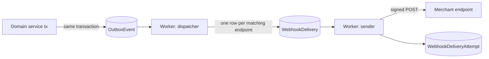

# 10 — API, webhooks and the future app platform

> Milestone 0 deliverable. Status: **proposed, awaiting review**.
> Wire-level conventions: [docs/api/README.md](../api/README.md).

## 1. API surfaces

| API                        | Consumers                                     | Auth                                                                             | Host / path                                |
| -------------------------- | --------------------------------------------- | -------------------------------------------------------------------------------- | ------------------------------------------ |
| **Dashboard internal**     | the dashboard UI                              | session cookie + Server Actions                                                  | `app.storevia.com` (not a public contract) |
| **Admin REST API v1**      | merchant integrations, later third-party apps | `Authorization: Bearer <api key or OAuth token>`, scopes                         | `https://api.storevia.com/api/v1/…`        |
| **Storefront API** (later) | headless storefronts, mobile apps             | public storefront token per store (read-only catalogue, cart/checkout mutations) | `https://{store host}/api/storefront/v1/…` |
| **Inbound webhooks**       | Stripe, payment providers                     | provider signatures                                                              | `app.storevia.com/api/webhooks/…`          |

The dashboard's server actions and the public API call the **same domain
services** with the same `TenantContext`/`authorize` pipeline. There is one
business-logic implementation, with two transports.

## 2. Admin API design

- Resource-oriented REST with JSON, versioned by path (`/api/v1`). Breaking
  changes → `v2`. Additive changes (new fields, new endpoints) within a
  version. A dated `Storevia-Version` header may refine behaviour later
  without new paths.
- **Public IDs** are TypeIDs (`prod_01j9…`, `ord_…`, `var_…`). Internal
  column names, join tables and DB-specific shapes are not exposed.
  Responses are explicit DTOs mapped from domain objects.
- **Scopes** (initial): `products:read`, `products:write`, `inventory:read`,
  `inventory:write`, `orders:read`, `orders:write`, `customers:read`,
  `customers:write`, `discounts:read`, `discounts:write`, `content:read`,
  `content:write`, `webhooks:read`, `webhooks:write`. Each scope maps to one
  or more RBAC permissions; a request needs the permission **and** the
  `api_access` entitlement.
- **API keys**: bound to one store; created by members with
  `api_key.manage` (step-up auth required); the secret
  (`sv_live_<prefix>_<secret>`) is shown once; only its hash is stored;
  optional expiry; revocable; `lastUsedAt` tracked; auto-revocation on
  secret-scanning reports (GitHub secret scanning partner format).
- Every mutating endpoint accepts `Idempotency-Key` (stored in
  `IdempotencyKey`, 24 h), so retries are safe.
- Rate limits per key and per store (token bucket), returned in
  `RateLimit-*` headers; `429` with `Retry-After`.
- OpenAPI 3.1 document generated from the zod schemas
  (`packages/validation`), published at `/api/v1/openapi.json`.

## 3. Outbound webhooks

### 3.1 Events

Initial catalogue: `product.created`, `product.updated`, `product.deleted`,
`order.created`, `order.paid`, `order.fulfilled`, `order.cancelled`,
`customer.created`, `customer.updated`, `inventory.updated`. Each event
has a versioned payload schema (the same DTOs as the API).

### 3.2 Pipeline

- **Transactional outbox:** the event row commits atomically with the change,
  so no event is lost or phantom.
- **Signing:** `Storevia-Signature: t=<unix>,v1=<hex HMAC-SHA256(secret, t + "." + body)>` plus `Storevia-Webhook-Id` (delivery ID, for receiver
  idempotency) and `Storevia-Event-Type`. Receivers reject timestamps older
  than 5 minutes. During secret rotation both secrets sign (two `v1` values)
  until the old one expires.
- **Retries:** exponential backoff with jitter (≈ 1 min, 5 min, 30 min, 2 h,
  6 h, 12 h, 24 h…) for up to 3 days; then `DEAD_LETTER`. Merchants can
  replay dead-lettered deliveries from the dashboard.
- **Auto-disable:** after N consecutive failures spanning ≥ 3 days, the
  endpoint is `DISABLED` with a reason, and the merchant is emailed.
- **Delivery logs:** each attempt stores status code, duration and a
  truncated (≤ 4 KiB) response excerpt for 30 days.
- **SSRF protection:** endpoint URLs must be `https`, and are resolved and
  checked at **send time** (not only at creation) against private,
  loopback, link-local and metadata IP ranges, with a DNS-pinned connection
  and no redirects. Egress goes through a dedicated proxy with the same
  deny-list.
- Delivery order is not guaranteed; payloads carry `occurredAt` and the
  resource's `updatedAt` so receivers can discard stale events.

## 4. Future app platform (not built yet; not blocked)

| Future concept                  | How today's design accommodates it                                                                       |
| ------------------------------- | -------------------------------------------------------------------------------------------------------- |
| `App` (developer-registered)    | Platform-scope table; apps authenticate with OAuth 2.1 client credentials + authorisation code with PKCE |
| `AppInstallation` (app ↔ store) | Store-scoped; becomes the actor type `APP` in `TenantContext` and `AuditLog.actorType`                   |
| `OAuthGrant` / `AppScope`       | Scopes reuse the API scope catalogue, and consent screens list them. An app receives only granted scopes |
| `WebhookSubscription`           | `WebhookEndpoint` gains a nullable `appInstallationId`; uninstall removes the app's endpoints            |
| App UI extensions               | Sandboxed iframes in the dashboard with a postMessage bridge; never direct DB access                     |
| App billing                     | Separate ledger; out of scope                                                                            |

Invariants that already hold: third-party code never gets database access,
never runs on Storevia servers, and sees tenant data only through the scoped
API.
