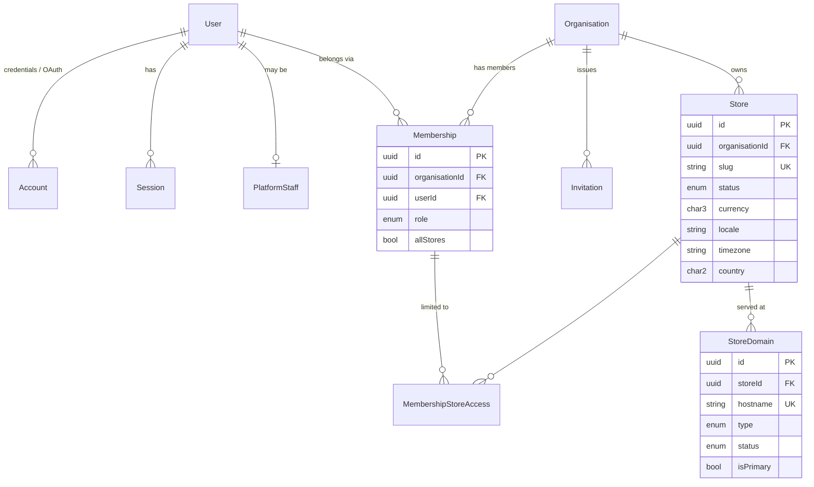
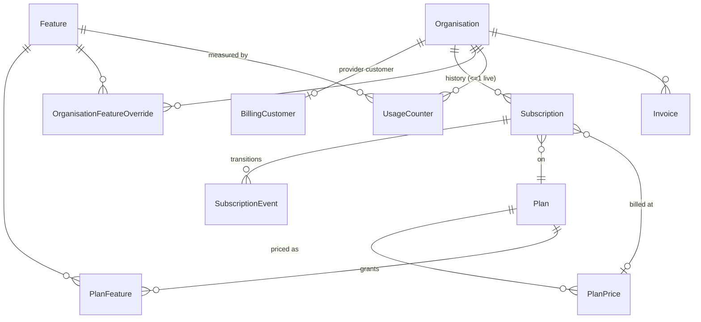
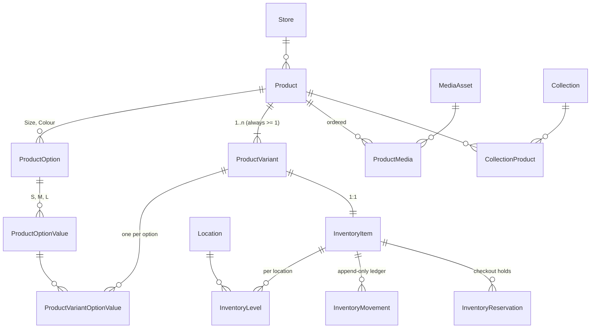
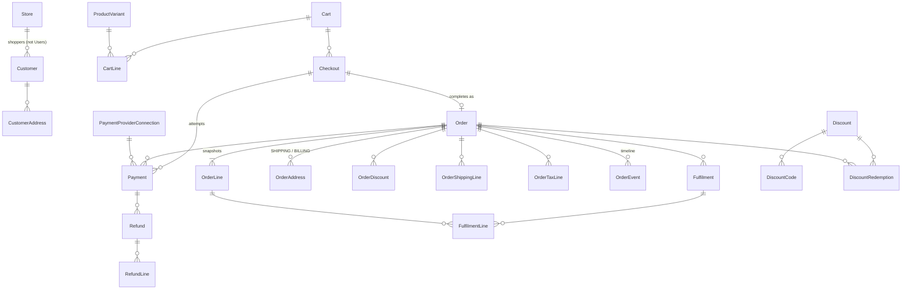
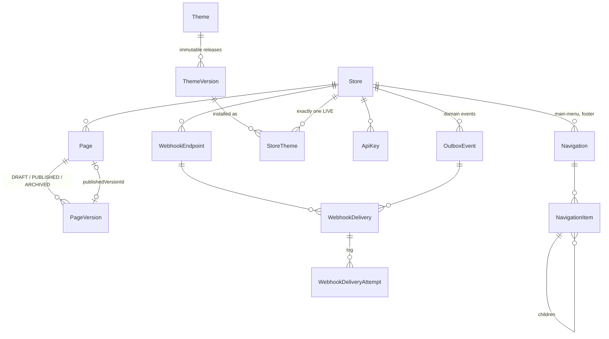

# Storevia — Entity Relationship Design

> Milestone 0 deliverable. Status: **proposed, awaiting review**.
>
> The full field-level design is in [`schema.draft.prisma`](./schema.draft.prisma)
> (79 models, validated by `prisma validate` in CI). This document explains the
> relationships, ownership, uniqueness, indexing and deletion rules behind it.
> Data retention and migration policy are in [`data-lifecycle.md`](./data-lifecycle.md).

## 1. Scope classes

Every table belongs to exactly one **scope class**. The scope decides which
ownership columns the table carries and which row-level-security (RLS) policy
applies (see [tenancy](../architecture/03-tenancy.md)).

| Scope            | Ownership columns            | Examples                                                                                                                                                                 | RLS policy                                                                               |
| ---------------- | ---------------------------- | ------------------------------------------------------------------------------------------------------------------------------------------------------------------------ | ---------------------------------------------------------------------------------------- |
| **Platform**     | none                         | `Plan`, `PlanPrice`, `Feature`, `PlanFeature`, `Theme`, `ThemeVersion`, `BillingWebhookEvent`                                                                            | Read-only to app role for catalogue tables; webhook ledger writable only by billing role |
| **Identity**     | `userId`                     | `User`, `Account`, `Session`, `Verification`, `PlatformStaff`                                                                                                            | Accessed only through `packages/auth`; not tenant data                                   |
| **Organisation** | `organisationId`             | `Organisation`, `Membership`, `Invitation`, `Subscription`, `SubscriptionEvent`, `Invoice`, `UsageCounter`, `OrganisationFeatureOverride`, `BillingCustomer`, `AuditLog` | `organisationId = app.organisation_id`                                                   |
| **Store**        | `organisationId` + `storeId` | everything commercial: products, inventory, customers, carts, orders, pages, domains, media, webhooks…                                                                   | `organisationId = app.organisation_id` (and, when set, `storeId = app.store_id`)         |

Rules:

1. A Store-scoped row always carries **both** `organisationId` and `storeId`.
   `organisationId` is denormalised deliberately so that RLS policies are a
   single indexed equality, not a join.
2. Both columns are **required and immutable** (an update trigger rejects
   changes; a store never moves between organisations — a "transfer" is an
   export/import).
3. Store-scoped rows reference their store through the composite foreign key
   `(storeId, organisationId) → Store(id, organisationId)`. A row therefore
   cannot claim a store belonging to another organisation even if application
   code is wrong.
4. Child rows reference their parent through `(parentId, storeId) → Parent(id, storeId)`. This makes cross-store links **unrepresentable**: a
   `CollectionProduct` cannot join a collection from store A to a product from
   store B, a `CartLine` cannot contain another store's variant, a `Payment`
   cannot point at another store's provider connection.
5. **Optional same-store references** (nullable, often `ON DELETE SET NULL`)
   are declared single-column in Prisma, because Prisma cannot express an
   optional relation over a required `storeId`. The migration then adds the
   composite FK `(refId, storeId) → Target(id, storeId)` with
   `ON DELETE SET NULL (refId)` (the PostgreSQL 15+ column-list form, which
   nulls only the reference and never `storeId`). With `MATCH SIMPLE`, a NULL
   reference is not checked; a non-NULL one must be in the same store. The
   complete list is in §6, so rule 4 holds for these links too.
6. Historical references that must survive a purge (e.g. `OrderLine.productId`)
   follow rule 5. The row keeps its own snapshot values, so losing the link
   loses nothing commercial.

## 2. Conventions

| Topic              | Decision                                                                                    | Why                                                                                                                              |
| ------------------ | ------------------------------------------------------------------------------------------- | -------------------------------------------------------------------------------------------------------------------------------- |
| Primary keys       | UUIDv7, native `uuid` column (ADR-0006)                                                     | Globally unique across tenants (safe merges, exports, sharding later); time-ordered so B-tree inserts stay local; not enumerable |
| External IDs       | TypeID encoding of the same UUID, e.g. `prod_01j9…` (ADR-0006)                              | Self-describing in logs/APIs, prevents passing a product ID where an order ID is expected; no second lookup column               |
| Money              | `BigInt` minor units + `Char(3)` ISO-4217 currency (ADR-0010)                               | No floating-point error; `BigInt` because `Int` overflows at ~21M in two-decimal currencies                                      |
| Percentages        | basis points (`Int`, 1000 = 10%)                                                            | Integer arithmetic                                                                                                               |
| Tax rates          | parts-per-million (`Int`, 7.25% = 72 500)                                                   | Tax rates need more precision than bps                                                                                           |
| Weight             | integer grams                                                                               | Unit conversion is presentation                                                                                                  |
| Timestamps         | `timestamptz(3)`, stored UTC                                                                | Unambiguous; store timezone applied at presentation/reporting                                                                    |
| Country / currency | `Char(2)` ISO-3166-1 alpha-2 / `Char(3)` ISO-4217                                           | International by default                                                                                                         |
| Rich text          | Tiptap/ProseMirror JSON (canonical) + derived sanitised HTML cache                          | Never trust stored HTML; re-render when the sanitiser changes                                                                    |
| Emails             | stored lower-cased; `citext` in SQL                                                         | Case-insensitive uniqueness                                                                                                      |
| Handles/slugs      | lower-case, `[a-z0-9-]`, unique per store among non-deleted rows                            | Stable URLs                                                                                                                      |
| Names in DB        | Prisma model/field names (PascalCase tables, camelCase columns); raw SQL quotes identifiers | One naming scheme across TS and SQL                                                                                              |
| Soft delete        | `deletedAt` on merchant-deletable business entities; `archivedAt`/status for lifecycle      | Protects order history and allows undo; purge jobs hard-delete later per retention policy                                        |

## 3. Diagrams

Diagrams show keys and relationships only; see the Prisma draft for fields.

### 3.1 Identity and tenancy

### 3.2 Plans, entitlements, subscriptions

### 3.3 Catalogue, media and inventory

### 3.4 Customers, carts, checkout, orders, payments

### 3.5 Website content, themes and integration

## 4. Entity notes (relationships, uniqueness, deletion)

The tables below list, per aggregate, the invariants that are not obvious from
the diagrams. "Purge" means the retention job's hard delete; merchants never
trigger hard deletes directly.

### 4.1 Identity & tenancy

| Entity          | Uniqueness                                                                            | Deletion                                                                                                                                                                                                   |
| --------------- | ------------------------------------------------------------------------------------- | ---------------------------------------------------------------------------------------------------------------------------------------------------------------------------------------------------------- |
| `User`          | `email` (citext)                                                                      | Never hard-deleted by the app. Account deletion scrubs PII, disables login, revokes sessions; blocked while the user is the sole OWNER of any organisation. Deleting a user never deletes an organisation. |
| `Account`       | `(providerId, accountId)`                                                             | Cascades from User purge only.                                                                                                                                                                             |
| `Session`       | `tokenHash`                                                                           | Cascades from User; expired rows purged daily.                                                                                                                                                             |
| `Verification`  | `valueHash`                                                                           | Deleted on use; expired rows purged.                                                                                                                                                                       |
| `PlatformStaff` | `userId` (PK)                                                                         | Deactivate (`active=false`), never delete — audit references it.                                                                                                                                           |
| `Organisation`  | —                                                                                     | `PENDING_DELETION` → grace period → data export offered → purge job. `Restrict` from every child.                                                                                                          |
| `Membership`    | `(organisationId, userId)`; **exactly one `OWNER` per organisation** (partial unique) | Removing a member deletes the membership row only; business data created by them stays (FKs to users are nullable/`SetNull` or plain IDs in snapshots).                                                    |
| `Invitation`    | `tokenHash`; one `PENDING` invite per `(organisationId, email)`                       | Status transitions only; purge after 90 days.                                                                                                                                                              |
| `Store`         | `slug` global; `(id, organisationId)` for composite FKs                               | `ARCHIVED` status, never hard-deleted while orders exist. `Restrict` from every child.                                                                                                                     |
| `StoreDomain`   | `hostname` global; one `isPrimary` per store (partial unique)                         | Hard delete allowed (it is configuration); an audit event is written.                                                                                                                                      |

### 4.2 Billing & entitlements

| Entity                | Uniqueness                                                                                         | Notes                                                                                                                                                 |
| --------------------- | -------------------------------------------------------------------------------------------------- | ----------------------------------------------------------------------------------------------------------------------------------------------------- |
| `Plan`                | `code`                                                                                             | `code` is for seeds/ops; application code never branches on it. Plans are archived, never deleted (subscriptions reference them).                     |
| `PlanPrice`           | `(provider, providerPriceId)`                                                                      | Prices are immutable at the provider; a price change = new row, old row `active=false`.                                                               |
| `Feature`             | `key`                                                                                              | Keys mirrored by a typed `FeatureKey` union in `packages/entitlements`; a CI test asserts DB seed ↔ code parity.                                      |
| `PlanFeature`         | `(planId, featureId)`                                                                              | `limit NULL` = unlimited.                                                                                                                             |
| `Subscription`        | `providerSubscriptionId`; at most one non-`EXPIRED` subscription per organisation (partial unique) | Syncs per subscription are serialised and re-fetch provider state; `providerSyncedAt` discards a stale sync (see 05 §4).                              |
| `BillingWebhookEvent` | `(provider, providerEventId)`                                                                      | The insert **is** the idempotency check.                                                                                                              |
| `UsageCounter`        | `(organisationId, featureId, scopeKey, period)`                                                    | Changed with `SELECT … FOR UPDATE` in the same transaction as the counted resource; nightly reconciliation job recomputes gauges and alerts on drift. |

### 4.3 Catalogue

| Entity                      | Uniqueness                                                                       | Notes                                                                                                                                                                    |
| --------------------------- | -------------------------------------------------------------------------------- | ------------------------------------------------------------------------------------------------------------------------------------------------------------------------ |
| `Product`                   | `(storeId, handle)` among non-deleted                                            | Soft delete. Purge only when no `OrderLine` needs the link (and even then `SetNull`).                                                                                    |
| `ProductOption`             | `(productId, name)`, `(productId, position)`                                     | Max 3 options per product (service rule, keeps variant matrix bounded).                                                                                                  |
| `ProductOptionValue`        | `(optionId, value)`                                                              |                                                                                                                                                                          |
| `ProductVariant`            | `(productId, optionSignature)`; `(storeId, sku)` among non-deleted, when SKU set | **Every product has ≥ 1 variant.** A product with no options has one default variant with `optionSignature = ""`. Price CHECKs (`>= 0`, compare-at > price).             |
| `ProductVariantOptionValue` | PK `(variantId, optionId)`                                                       | Composite FK `(optionValueId, optionId)` guarantees the value belongs to that option.                                                                                    |
| `Collection`                | `(storeId, handle)` among non-deleted                                            | `SMART` rules are a validated JSON rule set evaluated by the commerce service.                                                                                           |
| `CollectionProduct`         | PK `(collectionId, productId)`                                                   | Cross-store membership impossible (composite FKs).                                                                                                                       |
| `MediaAsset`                | `storageKey`                                                                     | `storageKey` is server-generated `{org}/{store}/{media}/original`; user filenames are metadata only. Soft delete, object removed by purge job after references are gone. |

**Category**: the specification lists `Category` among core models (§11) but not
in the initial ERD (§44). Merchandising grouping is served by `Collection`.
`Category` is modelled as a **global, platform-maintained product taxonomy**
(read-only reference data, e.g. for tax codes and marketplace feeds) referenced
by `Product.categoryCode`. The taxonomy table is deferred to Milestone 3.

### 4.4 Inventory

- `InventoryItem` is 1:1 with `ProductVariant` (unique `variantId`).
- `InventoryLevel` is unique per `(inventoryItemId, locationId)`; stores
  `available`, `reserved`, `incoming` (on hand = available + reserved).
- **No code path writes `InventoryLevel` directly.** The inventory service
  applies a change with a conditional `UPDATE … SET available = available + $d WHERE … AND available + $d >= 0` (unless the variant's policy is `CONTINUE`)
  and inserts an `InventoryMovement` with `reason`, `delta`, `resultingValue`
  and a reference (order, checkout, transfer…) in the same transaction.
- `InventoryMovement` is append-only (`UPDATE`/`DELETE` revoked from the app
  database role).
- `InventoryReservation` holds stock between "checkout enters payment" and
  "order created" (converted) or expiry (released by the worker).

### 4.5 Customers, checkout and orders

- `Customer` is store-scoped and entirely separate from `User`. The same
  person buying from two stores is two `Customer` rows. Customer
  authentication (accounts, sessions) is a separate identity realm added with
  customer accounts (post-M6) and will never reuse the merchant `Session`
  table.
- `Cart` stores **no prices**. `Checkout` stores the last server-computed
  quote plus a `pricingHash`; the quote is recomputed and compared immediately
  before payment.
- `Order.orderNumber` is unique per store and allocated from
  `Store.nextOrderNumber` with `UPDATE … RETURNING` (gap-tolerant, never
  reused).
- Orders and all `Order*` children are **immutable snapshots**: titles, SKUs,
  prices, discounts, taxes, addresses. Post-purchase changes (refunds,
  fulfilments, cancellations) are new rows plus status transitions, never
  edits of the original lines. `Restrict` everywhere — orders are never
  cascaded away. The **only** permitted in-place edit is a legal erasure
  request, which replaces shopper PII fields (email, phone, names, address
  lines) with anonymised placeholders while every commercial value stays
  unchanged ([data-lifecycle.md §5](./data-lifecycle.md#5-erasure-requests-storefront-customers)).
- Payment state (`paymentStatus`) and fulfilment state (`fulfilmentStatus`)
  are separate columns. `CANCELLED` in the fulfilment enum follows the
  specification; `cancelledAt`/`cancelReason` record the cancellation itself.
- `Payment.idempotencyKey` and `Refund.idempotencyKey` are unique so retried
  requests cannot double-charge or double-refund.

### 4.6 Content & themes

- `Page` has at most one `DRAFT` and at most one `PUBLISHED` `PageVersion`
  (two partial unique indexes). `Page.publishedVersionId` is the single
  pointer the storefront reads; `publishPage()` swaps it atomically.
- `PageVersion.document` is immutable once the version leaves `DRAFT`
  (trigger). Restoring an old version copies its document into the draft.
  Published and archived documents are never rewritten by schema upgrades;
  they are upgraded in memory on read (07 §7).
- `Page.publishedVersionId` has the SQL composite FK
  `(publishedVersionId, id) → PageVersion(id, pageId)`, so a page can only
  publish one of its own versions.
- Pages are store-level, not theme-level (ADR-0012).
- `Theme` is platform catalogue data with no tenant owner. Private
  per-organisation themes are deferred (§7).
- `ThemeVersion` rows are immutable once `RELEASED` (trigger), except for the
  `status` column moving to `DEPRECATED`/`REVOKED`.
- `StoreTheme`: exactly one `LIVE` per store (partial unique). Customisation
  edits `draftSettings`; publishing copies to `publishedSettings`.
- `NavigationItem` targets are typed references (`PAGE`, `PRODUCT`,
  `COLLECTION`, …) with `SetNull`; a dangling item is hidden by the renderer
  and flagged in the dashboard. A CHECK enforces that the column matching
  `targetType` is the one that is set. `parentId` must be in the same
  navigation (SQL composite FK `(parentId, navigationId) → (id, navigationId)`). Depth ≤ 3 (service rule).

### 4.7 Integration & audit

- `ApiKey`: only `secretHash` is stored; `prefix` (public) is shown in the UI.
- `WebhookEndpoint`: the signing secret must be usable, so it is
  envelope-encrypted rather than hashed. Rotation keeps the previous secret
  valid for a window.
- `OutboxEvent` is written in the same transaction as the state change it
  describes; the worker fans it out to `WebhookDelivery` rows (unique per
  endpoint + event, so fan-out is idempotent).
- `WebhookDeliveryAttempt` stores response excerpts from merchant endpoints,
  so it is Store-scoped like every other delivery table: it carries
  `organisationId` + `storeId` and references its delivery through
  `(deliveryId, storeId)`.
- `AuditLog` is append-only, organisation-scoped when a tenant is involved,
  and partitioned by month in production. Its primary key is
  `(id, createdAt)` because PostgreSQL requires the partition key in the
  primary key.

## 5. Indexing strategy

1. **Every foreign key has an index led by its first column** (Postgres does
   not do this automatically). The draft schema is checked for this; for
   composite FKs the target side is covered by `@@unique([id, storeId])`.
2. **Tenant-leading composite indexes** for list screens:
   `(storeId, status, updatedAt)`, `(storeId, placedAt)`, `(storeId, createdAt)`. Every dashboard list query filters by `storeId` first.
3. **Keyset pagination** on `(sortKey, id)`; offset pagination is not used
   for large tables.
4. **Partial indexes** for "active only" uniqueness (soft delete) and for
   worker queues (`status IN ('PENDING','RETRYING')`).
5. **Search**: `tsvector` generated columns + GIN on products, collections,
   customers, orders (email/number); `pg_trgm` for fuzzy SKU/title look-ups.
   Behind the `SearchIndex` interface (ADR-0018).
6. Every new query path gets an `EXPLAIN` check in review for tables expected
   to exceed 1M rows (orders, order lines, inventory movements, audit logs,
   webhook deliveries).

## 6. Constraints added in SQL migrations

Prisma cannot express these; they are part of the migration that creates each
table and are covered by integration tests.

| Constraint                                                                                         | Table(s)                                                                                                                                                                                                                                                                                                                                                                                                                                                                                                                                                                                                                                                                                                                                                                                                                                                                                                                                |
| -------------------------------------------------------------------------------------------------- | --------------------------------------------------------------------------------------------------------------------------------------------------------------------------------------------------------------------------------------------------------------------------------------------------------------------------------------------------------------------------------------------------------------------------------------------------------------------------------------------------------------------------------------------------------------------------------------------------------------------------------------------------------------------------------------------------------------------------------------------------------------------------------------------------------------------------------------------------------------------------------------------------------------------------------------- |
| RLS enabled + `FORCE ROW LEVEL SECURITY` + tenant policy                                           | every Organisation- and Store-scoped table                                                                                                                                                                                                                                                                                                                                                                                                                                                                                                                                                                                                                                                                                                                                                                                                                                                                                              |
| Immutable `organisationId` / `storeId` (update trigger)                                            | every Organisation- and Store-scoped table                                                                                                                                                                                                                                                                                                                                                                                                                                                                                                                                                                                                                                                                                                                                                                                                                                                                                              |
| `citext` email columns                                                                             | `User`, `Invitation`, `Customer`                                                                                                                                                                                                                                                                                                                                                                                                                                                                                                                                                                                                                                                                                                                                                                                                                                                                                                        |
| Partial unique: one `OWNER` per organisation                                                       | `Membership`                                                                                                                                                                                                                                                                                                                                                                                                                                                                                                                                                                                                                                                                                                                                                                                                                                                                                                                            |
| Partial unique: one pending invitation per org+email                                               | `Invitation`                                                                                                                                                                                                                                                                                                                                                                                                                                                                                                                                                                                                                                                                                                                                                                                                                                                                                                                            |
| Partial unique: one live subscription per organisation                                             | `Subscription`                                                                                                                                                                                                                                                                                                                                                                                                                                                                                                                                                                                                                                                                                                                                                                                                                                                                                                                          |
| Partial unique: one primary domain per store                                                       | `StoreDomain`                                                                                                                                                                                                                                                                                                                                                                                                                                                                                                                                                                                                                                                                                                                                                                                                                                                                                                                           |
| Partial unique: handle among non-deleted rows                                                      | `Product`, `Collection`, `Page`                                                                                                                                                                                                                                                                                                                                                                                                                                                                                                                                                                                                                                                                                                                                                                                                                                                                                                         |
| Partial unique: SKU among non-deleted variants                                                     | `ProductVariant`                                                                                                                                                                                                                                                                                                                                                                                                                                                                                                                                                                                                                                                                                                                                                                                                                                                                                                                        |
| Partial unique: customer email among non-deleted                                                   | `Customer`                                                                                                                                                                                                                                                                                                                                                                                                                                                                                                                                                                                                                                                                                                                                                                                                                                                                                                                              |
| Partial unique: one DRAFT, one PUBLISHED version per page                                          | `PageVersion`                                                                                                                                                                                                                                                                                                                                                                                                                                                                                                                                                                                                                                                                                                                                                                                                                                                                                                                           |
| Partial unique: one special page per kind                                                          | `Page` (kind ≠ `STANDARD`)                                                                                                                                                                                                                                                                                                                                                                                                                                                                                                                                                                                                                                                                                                                                                                                                                                                                                                              |
| Partial unique: one LIVE theme per store                                                           | `StoreTheme`                                                                                                                                                                                                                                                                                                                                                                                                                                                                                                                                                                                                                                                                                                                                                                                                                                                                                                                            |
| CHECK money ≥ 0; compare-at > price                                                                | variants, orders, payments, refunds                                                                                                                                                                                                                                                                                                                                                                                                                                                                                                                                                                                                                                                                                                                                                                                                                                                                                                     |
| CHECK quantity > 0                                                                                 | cart/order/refund/fulfilment lines                                                                                                                                                                                                                                                                                                                                                                                                                                                                                                                                                                                                                                                                                                                                                                                                                                                                                                      |
| CHECK `reserved >= 0`, `incoming >= 0`                                                             | `InventoryLevel`                                                                                                                                                                                                                                                                                                                                                                                                                                                                                                                                                                                                                                                                                                                                                                                                                                                                                                                        |
| CHECK discount value matches type                                                                  | `Discount`                                                                                                                                                                                                                                                                                                                                                                                                                                                                                                                                                                                                                                                                                                                                                                                                                                                                                                                              |
| CHECK navigation target column matches type                                                        | `NavigationItem`                                                                                                                                                                                                                                                                                                                                                                                                                                                                                                                                                                                                                                                                                                                                                                                                                                                                                                                        |
| CHECK hostname is lower-case, no port                                                              | `StoreDomain`                                                                                                                                                                                                                                                                                                                                                                                                                                                                                                                                                                                                                                                                                                                                                                                                                                                                                                                           |
| Immutability trigger once published/released                                                       | `PageVersion`, `ThemeVersion`                                                                                                                                                                                                                                                                                                                                                                                                                                                                                                                                                                                                                                                                                                                                                                                                                                                                                                           |
| `UPDATE`/`DELETE` revoked from app role                                                            | `AuditLog`, `InventoryMovement`, `SubscriptionEvent`, `OrderEvent`. Only the `storevia_retention` role (worker purge jobs) may `DELETE` rows. Detaching and dropping expired `AuditLog` partitions needs table ownership, so it runs as a scheduled maintenance job under the schema owner (`storevia_migrator`). `OrderEvent` and `AuditLog` metadata never contain shopper PII, so erasure never needs to edit them                                                                                                                                                                                                                                                                                                                                                                                                                                                                                                                   |
| `tsvector` generated columns + GIN                                                                 | `Product`, `Collection`, `Customer`, `Order` (email, number)                                                                                                                                                                                                                                                                                                                                                                                                                                                                                                                                                                                                                                                                                                                                                                                                                                                                            |
| Composite same-store FKs for optional references (rule 5), `ON DELETE SET NULL (col)` unless noted | `Cart.customerId`, `Checkout.customerId`, `Order.customerId`, `Payment.checkoutId`, `Payment.orderId` (RESTRICT), `InventoryReservation.checkoutId`, `InventoryReservation.orderId` (RESTRICT), `DiscountRedemption.discountCodeId`, `DiscountRedemption.customerId`, `OrderLine.productId`, `OrderLine.variantId`, `OrderTaxLine.orderLineId` (RESTRICT), `NavigationItem.pageId`, `NavigationItem.productId`, `NavigationItem.collectionId`, `Store.logoMediaId`, `Store.faviconMediaId`, `ProductVariant.imageMediaId`, `Collection.imageMediaId`, `RefundLine.restockLocationId` (RESTRICT), `Checkout.shippingRateId`, `Checkout.completedOrderId` (RESTRICT), `PageVersion.basedOnVersionId`. Informational snapshot IDs with **no** FK by design (rule 6: the row keeps its own snapshot and the source may be deleted): `OrderDiscount.discountId`, `OrderShippingLine.shippingRateId`, and actor columns such as `createdById` |
| Composite FK to a parent-scoped key                                                                | `Page.publishedVersionId` → `PageVersion(id, pageId)`; `NavigationItem.parentId` → `NavigationItem(id, navigationId)` (CASCADE)                                                                                                                                                                                                                                                                                                                                                                                                                                                                                                                                                                                                                                                                                                                                                                                                         |

## 7. Deliberately deferred

| Item                                                                      | Reason                                                                                                                                                                | Planned       |
| ------------------------------------------------------------------------- | --------------------------------------------------------------------------------------------------------------------------------------------------------------------- | ------------- |
| `App`, `AppInstallation`, `OAuthGrant`, `AppScope`, `WebhookSubscription` | Marketplace is out of scope; `ApiKey.scopes`, `WebhookEndpoint` and the outbox are shaped so installations can own them later (`appInstallationId` column added then) | Post-M8       |
| Customer accounts / sessions                                              | Separate identity realm per store                                                                                                                                     | After M6      |
| Product taxonomy (`Category`)                                             | Global reference data                                                                                                                                                 | M3            |
| Custom roles (`Role`, `RolePermission`)                                   | System roles cover launch; `advanced_permissions` entitlement gates custom roles later                                                                                | Post-M8       |
| Multi-currency price lists, markets                                       | `ProductVariant.currency` is explicit so price lists can be added without rewriting                                                                                   | Later         |
| Store slug history (prevent immediate reuse of released slugs)            | Anti-phishing; small table                                                                                                                                            | M4            |
| Private (organisation-owned) custom themes                                | Needs a tenant-scoped availability table so `Theme` stays platform data                                                                                               | Revisit in M7 |
| Theme-level template overrides                                            | Not needed while pages are store-level                                                                                                                                | Revisit in M7 |
