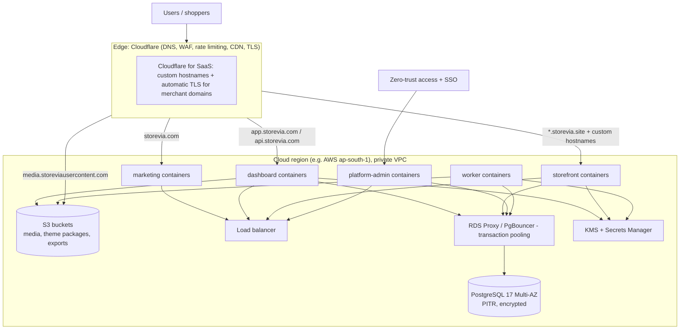

# Deployment architecture

> Milestone 0 deliverable. Status: **approved baseline (Milestone 0, 2026-09-24)**. ADR-0016.
> Vendor choices below are recommendations. Every provider sits behind an
> interface or standard protocol so it can be replaced.

## 1. Principles

- **Portable workloads:** every app builds to a standard OCI container (Next.js
  `standalone` output; worker bundled with `tsup`). No runtime lock-in to a
  single PaaS.
- **Managed stateful services:** PostgreSQL, object storage, KMS and secrets
  are managed services with backups and encryption at rest.
- **Infrastructure as code** (Terraform/OpenTofu) for everything except
  ephemeral preview environments.
- **Immutable, reproducible releases:** the image tagged with the git SHA
  that passed CI is what gets deployed. Environments differ only in
  configuration.

## 2. Environments

| Environment | Purpose                            | Data                                                     | Deploys                                     |
| ----------- | ---------------------------------- | -------------------------------------------------------- | ------------------------------------------- |
| Local       | Development                        | `seed:dev` in local PostgreSQL (docker compose)          | —                                           |
| CI          | Tests                              | Ephemeral PostgreSQL service container                   | every push                                  |
| Preview     | Per-PR review                      | Ephemeral DB branch or shared preview DB with `seed:dev` | per PR (dashboard + storefront + marketing) |
| Staging     | Release candidate; production-like | Synthetic data only                                      | `main` merges                               |
| Production  | Customers                          | Real                                                     | tagged releases (manual approval)           |

Provider sandboxes (Stripe test mode, payment test provider) are used
everywhere except production.

## 3. Production topology (recommended)



| Component                     | Recommendation                                                                                | Replaceable by                                                                                                                       |
| ----------------------------- | --------------------------------------------------------------------------------------------- | ------------------------------------------------------------------------------------------------------------------------------------ |
| Edge, WAF, CDN, DNS           | Cloudflare                                                                                    | Fastly, CloudFront + AWS WAF                                                                                                         |
| Merchant custom domains + TLS | Cloudflare for SaaS (custom hostnames, managed certificates)                                  | Caddy on-demand TLS, Vercel Domains API, AWS ACM + CloudFront. Hidden behind the `DomainProvisioner` interface in `packages/domains` |
| Compute                       | AWS ECS Fargate (or EKS later)                                                                | Any container platform (Fly.io, GKE, Render). A Vercel deployment of the Next.js apps is also viable for early stages                |
| Database                      | Amazon RDS / Aurora PostgreSQL 17, Multi-AZ                                                   | Neon, Crunchy Bridge, Cloud SQL                                                                                                      |
| Pooling                       | RDS Proxy or PgBouncer, **transaction mode** (compatible with transaction-local RLS settings) | —                                                                                                                                    |
| Object storage                | S3 (+ CDN)                                                                                    | R2, GCS, MinIO. Behind the S3 API                                                                                                    |
| Secrets / keys                | AWS Secrets Manager + KMS (envelope encryption keys)                                          | Vault, GCP KMS                                                                                                                       |
| Email                         | Amazon SES or Postmark                                                                        | behind the `EmailSender` interface                                                                                                   |
| Observability                 | OpenTelemetry → Grafana Cloud / Datadog; Sentry for errors                                    | any OTLP backend                                                                                                                     |
| Region                        | India (ap-south-1) first if launching in India; data-residency review pending (Q-S2)          | multi-region later                                                                                                                   |

## 4. Domains and TLS

| Host                                   | Points to                                 | TLS                                          |
| -------------------------------------- | ----------------------------------------- | -------------------------------------------- |
| `storevia.com`, `www`                  | marketing                                 | edge certificate                             |
| `app.storevia.com`, `api.storevia.com` | dashboard                                 | edge certificate                             |
| `admin.storevia.com`                   | platform-admin (behind zero-trust access) | edge certificate                             |
| `*.storevia.site`                      | storefront                                | wildcard edge certificate                    |
| merchant `shop.example.com`            | storefront via custom hostname            | issued and renewed automatically by the edge |
| `media.storeviausercontent.com`        | object storage via CDN                    | edge certificate                             |

Media bucket and CDN (ADR-0027 §9): the CDN serves only asset keys
(`{organisationId}/{storeId}/{mediaId}/original.*` and `w*.webp`) and must
**never serve the `uploads/` prefix**; a lifecycle rule expires `uploads/`
objects after one day. The CDN adds `X-Content-Type-Options: nosniff`, a
sandboxing `Content-Security-Policy` and the stored content type to every
media response. Uploads use S3 POST policies; confirm the provider enforces
`content-length-range` and exact `Content-Type` conditions before switching
providers.

Custom domain flow (M7): merchant adds hostname → Storevia shows DNS
instructions (CNAME `shops.storevia.site` for subdomains; A/ALIAS records or
a CNAME-flattening provider for apex domains) and a TXT verification record →
worker polls DNS (`VERIFYING`) → on success registers the custom hostname with
the edge provider (`DomainProvisioner.provision`) → certificate issued →
`ACTIVE`. Failures move to `FAILED` with a readable reason, and the worker
keeps re-checking for 72 h.

## 5. CI/CD

```text
PR opened → CI: install (frozen lockfile) → format:check → lint → typecheck
          → unit tests → integration tests (PostgreSQL service) → build
          → E2E (Playwright, on changes to apps) → secret scan → preview deploy
merge to main → same checks → build images (tag = SHA) → push to registry
          → run migrations on staging (migrator role) → deploy staging → smoke tests
release tag → manual approval → migrate production (expand-only) → rolling deploy
          → smoke tests → automatic rollback on failed health checks
```

- Migrations run **before** the deploy and are backwards-compatible
  ([data-lifecycle.md §1](../database/data-lifecycle.md#1-migrations)).
  Rolling back the app never requires rolling back the schema.
- GitHub Actions authenticates to the cloud with **OIDC** (no stored cloud
  keys). Third-party actions are pinned by commit SHA.
- Branch protection on `main`: required checks, required review (CODEOWNERS
  for security-sensitive packages), linear history, no force-push.

## 6. Background processing

- The worker service runs the Postgres-backed queue consumer (ADR-0014) and
  the schedulers (cron-style: reconciliation, retention purges, domain
  re-checks, reservation expiry, outbox dispatch).
- Scaled horizontally. Jobs are idempotent and use `SKIP LOCKED` claiming.
- Queue depth, job age and failure rate are exported as metrics with alerts.

## 7. Backups and disaster recovery

| Item                | Target                                                                                             |
| ------------------- | -------------------------------------------------------------------------------------------------- |
| DB backups          | Continuous (PITR, 35 days) + daily snapshots copied cross-region; monthly snapshots kept 12 months |
| Object storage      | Versioning on; cross-region replication for media and theme packages                               |
| RPO / RTO (initial) | RPO ≤ 5 min, RTO ≤ 4 h (region-level); revisit before enterprise tier                              |
| Restore drills      | Quarterly restore into an isolated environment, verified by a checksum/row-count script            |
| Secrets             | Rotation runbooks; KMS keys never exported                                                         |

## 8. Observability and operations

- Structured JSON logs with `requestId`, `organisationId`, `storeId`,
  `userId`, route and latency. PII and secrets are redacted.
- Traces across app → DB → provider calls (OpenTelemetry).
- Dashboards/alerts: error rate, p95 latency per surface, DB CPU/connections,
  slow queries (`pg_stat_statements`), queue lag, webhook failure rates,
  billing sync failures, certificate provisioning failures.
- Health endpoints: `/api/health` (liveness, implemented in M1). Readiness
  (DB reachable, migrations at the expected version) arrives in M8.
- Multi-instance deployments must set `NEXT_SERVER_ACTIONS_ENCRYPTION_KEY`
  (and a stable build ID) so every instance accepts the same Server Action
  payloads. Next.js otherwise generates the key per build.
- Status page and incident runbooks (M8).

## 9. Local development

Milestone 1 needs only a local PostgreSQL (16+; CI uses 17) with a superuser
for `DATABASE_ADMIN_URL`. `pnpm db:setup` creates the roles and databases,
`pnpm db:reset` migrates, and `pnpm db:seed:dev` adds demo tenants. Emails go
to JSON files (`EMAIL_TRANSPORT=file`) or any SMTP server such as Mailpit. A
`docker compose` file with PostgreSQL, MinIO and Mailpit is planned with the
media library (M3). Apps run with `pnpm dev`. Local hostnames use
`*.localhost`, which browsers resolve to loopback (Node.js does not, so health
probes use `localhost`):

| URL                                  | App            |
| ------------------------------------ | -------------- |
| `http://localhost:3000`              | marketing      |
| `http://app.localhost:3001`          | dashboard      |
| `http://{slug}.store.localhost:3002` | storefront     |
| `http://admin.localhost:3003`        | platform-admin |
