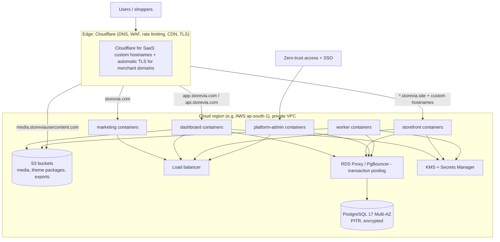

# Deployment architecture

> Milestone 0 deliverable. Status: **approved baseline (Milestone 0, 2026-09-24)**. ADR-0016.
> Vendor choices below are recommendations. Every provider sits behind an
> interface or standard protocol so it can be replaced.

## 1. Principles

- **Portable workloads:** every app builds to a standard OCI container (Next.js
  `standalone` output; worker bundled with `tsup`). No runtime lock-in to a
  single PaaS.
- **Managed stateful services:** PostgreSQL, object storage, KMS and secrets
  are managed services with backups and encryption at rest.
- **Infrastructure as code** (Terraform/OpenTofu) for everything except
  ephemeral preview environments.
- **Immutable, reproducible releases:** the image tagged with the git SHA
  that passed CI is what gets deployed. Environments differ only in
  configuration.

## 2. Environments

| Environment | Purpose                            | Data                                                     | Deploys                                     |
| ----------- | ---------------------------------- | -------------------------------------------------------- | ------------------------------------------- |
| Local       | Development                        | `seed:dev` in local PostgreSQL (docker compose)          | —                                           |
| CI          | Tests                              | Ephemeral PostgreSQL service container                   | every push                                  |
| Preview     | Per-PR review                      | Ephemeral DB branch or shared preview DB with `seed:dev` | per PR (dashboard + storefront + marketing) |
| Staging     | Release candidate; production-like | Synthetic data only                                      | `main` merges                               |
| Production  | Customers                          | Real                                                     | tagged releases (manual approval)           |

Provider sandboxes (Stripe test mode, payment test provider) are used
everywhere except production.

## 3. Production topology (recommended)


```mermaid
flowchart TB
  U[Users / shoppers] --> CF

  subgraph CF["Edge: Cloudflare (DNS, WAF, rate limiting, CDN, TLS)"]
    CH["Cloudflare for SaaS: custom hostnames + automatic TLS for merchant domains"]
  end

  CF -->|storevia.com| MKT
  CF -->|app.storevia.com / api.storevia.com| DASH
  CF -->|*.storevia.site + custom hostnames| SF
  CF -->|media.storeviausercontent.com| S3

  subgraph AWS["Cloud region (e.g. AWS ap-south-1), private VPC"]
    ALB[Load balancer]
    MKT[marketing containers]
    DASH[dashboard containers]
    SF[storefront containers]
    ADM[platform-admin containers]
    WRK[worker containers]
    PGB[RDS Proxy / PgBouncer - transaction pooling]
    RDS[(PostgreSQL 17 Multi-AZ<br/>PITR, encrypted)]
    S3[(S3 buckets<br/>media, theme packages, exports)]
    KMS[KMS + Secrets Manager]
  end

  ZT[Zero-trust access + SSO] --> ADM
  MKT & DASH & SF & ADM --> ALB
  DASH & SF & ADM & WRK --> PGB --> RDS
  DASH & WRK --> S3
  DASH & SF & WRK --> KMS
```

| Component                     | Recommendation                                                                                | Replaceable by                                                                                                                              |
| ----------------------------- | --------------------------------------------------------------------------------------------- | ------------------------------------------------------------------------------------------------------------------------------------------- |
| Edge, WAF, CDN, DNS           | Cloudflare                                                                                    | Fastly, CloudFront + AWS WAF                                                                                                                |
| Merchant custom domains + TLS | Vercel (domains on the one storefront project, managed certificates), M7 / ADR-0032           | Cloudflare for SaaS, Caddy on-demand TLS, AWS ACM + CloudFront. Behind the `DomainProvisioner` interface in `@storevia/domains/provisioner` |
| Compute                       | AWS ECS Fargate (or EKS later)                                                                | Any container platform (Fly.io, GKE, Render). A Vercel deployment of the Next.js apps is also viable for early stages                       |
| Database                      | Amazon RDS / Aurora PostgreSQL 17, Multi-AZ                                                   | Neon, Crunchy Bridge, Cloud SQL                                                                                                             |
| Pooling                       | RDS Proxy or PgBouncer, **transaction mode** (compatible with transaction-local RLS settings) | —                                                                                                                                           |
| Object storage                | S3 (+ CDN)                                                                                    | R2, GCS, MinIO. Behind the S3 API                                                                                                           |
| Secrets / keys                | AWS Secrets Manager + KMS (envelope encryption keys)                                          | Vault, GCP KMS                                                                                                                              |
| Email                         | Amazon SES or Postmark                                                                        | behind the `EmailSender` interface                                                                                                          |
| Observability                 | OpenTelemetry → Grafana Cloud / Datadog; Sentry for errors                                    | any OTLP backend                                                                                                                            |
| Region                        | India (ap-south-1) first if launching in India; data-residency review pending (Q-S2)          | multi-region later                                                                                                                          |

## 4. Domains and TLS

| Host                                   | Points to                                 | TLS                                        |
| -------------------------------------- | ----------------------------------------- | ------------------------------------------ |
| `storevia.com`, `www`                  | marketing                                 | edge certificate                           |
| `app.storevia.com`, `api.storevia.com` | dashboard                                 | edge certificate                           |
| `admin.storevia.com`                   | platform-admin (behind zero-trust access) | edge certificate                           |
| `*.storevia.site`                      | storefront                                | wildcard edge certificate                  |
| merchant `shop.example.com`            | storefront project (domain added via API) | issued and renewed by the hosting provider |
| `media.storeviausercontent.com`        | object storage via CDN                    | edge certificate                           |

Media bucket and CDN (ADR-0027 §9): the CDN serves only asset keys
(`{organisationId}/{storeId}/{mediaId}/original.*` and `w*.webp`) and must
**never serve the `uploads/` prefix**; a lifecycle rule expires `uploads/`
objects after one day. The CDN adds `X-Content-Type-Options: nosniff`, a
sandboxing `Content-Security-Policy` and the stored content type to every
media response, and `Cross-Origin-Resource-Policy: cross-origin` to asset
responses only (S3 object metadata can't set it). Storefronts
(`*.storevia.site`, custom domains) are never same-site with
`media.storeviausercontent.com`, so `same-site` or `same-origin` would block
every product image (`ERR_BLOCKED_BY_RESPONSE.NotSameSite`). No CORS header
(`Access-Control-Allow-Origin`) is needed or set: images load with plain
``. Refusals (`uploads/`, unknown keys) must not carry the
`cross-origin` policy. The local `/media/…` route follows the same contract,
checked by `apps/dashboard/e2e/storefront-media.spec.ts`. Uploads use S3 POST policies; confirm the provider enforces
`content-length-range` and exact `Content-Type` conditions before switching
providers.

### Storefront (Milestone 4)

What operating `apps/storefront` needs (ADR-0028):

| Setting                        | Used by               | Notes                                                                                                                                                                                                         |
| ------------------------------ | --------------------- | ------------------------------------------------------------------------------------------------------------------------------------------------------------------------------------------------------------- |
| `DATABASE_STOREFRONT_URL`      | storefront            | the `storevia_storefront` role: `LOGIN NOBYPASSRLS`, no other attributes. Grants come from migrations. Through the pooler in transaction mode, like the app role                                              |
| `STOREFRONT_ROOT_DOMAIN`       | storefront, dashboard | `storevia.site` in production; store hosts are `{slug}.{root}`                                                                                                                                                |
| `STOREFRONT_PROTOCOL`          | storefront, dashboard | unset (HTTPS) everywhere but plain-HTTP local and CI runs, which set `http`                                                                                                                                   |
| `STOREFRONT_PREVIEW_SECRET`    | storefront, dashboard | ≥ 32 random characters. Signs preview links; the storefront derives its internal header key from it with a separate label                                                                                     |
| `STOREFRONT_REVALIDATE_SECRET` | storefront, worker    | ≥ 32 random characters, different from the preview secret. Signs cache invalidations                                                                                                                          |
| `STOREFRONT_INTERNAL_URL`      | worker                | the storefront's private address (not through the edge). Required outside development and test: without it every dispatch run fails (visible in staff job health)                                             |
| `TRUSTED_CLIENT_IP_HEADER`     | storefront            | the header the edge sets to the client address (e.g. `CF-Connecting-IP`). **Set it in every deployed environment**: without it only existing carts are rate limited, and creating carts is not limited at all |

### Checkout and payments (Milestone 6)

What checkout, order confirmation and merchant payments need (ADR-0031):

| Setting                                     | Used by                                          | Notes                                                                                                                                                                                                                                                                                                                    |
| ------------------------------------------- | ------------------------------------------------ | ------------------------------------------------------------------------------------------------------------------------------------------------------------------------------------------------------------------------------------------------------------------------------------------------------------------------ |
| `DATABASE_CHECKOUT_URL`                     | storefront, dashboard (payment webhooks), worker | the `storevia_checkout` role: `LOGIN NOBYPASSRLS`, no other attributes (`pnpm db:setup` creates it locally). Grants and restrictive policies come from migrations. Through the pooler in transaction mode                                                                                                                |
| `PAYMENT_CREDENTIALS_KEYS`                  | dashboard, storefront, worker                    | versioned AES-256-GCM keyring for merchants' payment credentials: `1:<base64 32 bytes>[,2:<base64>]`. The highest version seals; every listed version opens. From KMS/Secrets Manager in production; rotate by adding a version, never by removing one still in use. Losing it means merchants reconnect their providers |
| `TEST_PAYMENTS_ENABLED`                     | storefront, dashboard                            | `true` only in local production builds and CI E2E. The Test Payment Provider also requires `STOREVIA_ENV` = `development` or `test`, so it can't be enabled in staging, preview or production                                                                                                                            |
| `RAZORPAY_API_URL`                          | dashboard, storefront, worker                    | unset (Razorpay's API). Only for pointing tests at a stub                                                                                                                                                                                                                                                                |
| `EMAIL_TRANSPORT`, `SMTP_URL`, `EMAIL_FROM` | worker                                           | order emails (confirmation, shipment, cancellation, refund) go out from the worker's queue; a failing relay retries with backoff and never affects orders                                                                                                                                                                |

- **Webhooks:** each connection's endpoint is
  `https://{dashboard host}/api/webhooks/payments/{connectionId}` (shown on
  the store's Payments settings). It is public, unauthenticated by cookie,
  and verified per connection; keep it reachable from the providers and
  don't cache it.
- **Storefront CSP:** `form-action` includes the providers' hosted-page
  origins (`packages/payments/src/origins.ts`); a new provider adds its
  origins there.
- **Worker jobs:** `checkout.expiry` (every minute), `checkout.purge`
  (hourly) and `orders.notifications` (every 30 s) must run in every
  environment that takes orders.

- **Edge:** forward the original `Host` header, overwrite the client-IP
  header named above, and don't forward `/api/internal/*` from the public
  internet (it is signed and time-limited anyway). Store HTML is dynamic
  (`no-store` for previews, carts and status pages); edge caching of
  store pages and purge by tag are M8.
- **HSTS:** the storefront sends `Strict-Transport-Security:
max-age=31536000` on every host it serves, without `includeSubDomains`
  or `preload`, because custom domains belong to merchants and those
  directives would force HTTPS onto their other subdomains. The
  `storevia.site` apex (served by the edge, not the storefront) carries
  `includeSubDomains; preload` as the
  [threat model §5](../security/threat-model.md#5-security-headers-all-web-apps)
  requires, which covers every store subdomain. The edge must not add
  `includeSubDomains` to custom-domain responses.
- **One instance for now:** the page-data cache and the host cache are per
  process, and the worker posts each invalidation to one URL. With more
  than one storefront instance, the others would keep serving changed or
  removed content until their 5-minute TTL. Run a single instance (with a
  restart policy) until invalidations are fanned out to every instance or
  a shared cache handler is added (M8).
- **Outbox:** the worker's `storefront.outbox-dispatch` job runs every 15
  seconds and purges dispatched events after 7 days. A growing count of
  undispatched events means the storefront is unreachable or refusing the
  signature; `storefront.outbox_dispatched` is recorded as a metric, and
  `storefront.invalidation_failed` counts failed revalidation calls (the
  events stay queued and are retried).
- **Site builder (M5) signals:** `site.publish_failed` and
  `site.draft_save_failed` (unexpected errors; refusals such as conflicts
  and validation aren't failures), `site.draft_conflict`,
  `site.page_validation_failed`, and on the storefront
  `storefront.unknown_component`, `storefront.invalid_component` and
  `storefront.invalid_document` (a stored block or page the renderer
  skipped). Logs carry ids, never documents or content. M5 adds no
  environment variables or services.
- **Public Suffix List:** see [public-suffix-list.md](./public-suffix-list.md).

### Custom domains and production hosting (Milestone 7)

See [production-hosting.md](./production-hosting.md) (ADR-0032): one
storefront deployment for every store, the Vercel project and wildcard
setup, the domain lifecycle and DNS records, the control plane (dashboard
and worker call the provider) and data plane (the storefront never does),
the provider variables, and what the owner configures by hand. The
Milestone 0 topology above (Cloudflare for SaaS in front of containers)
remains a valid alternative behind the same `DomainProvisioner` interface.

## 5. CI/CD

```text
PR opened → CI: install (frozen lockfile) → format:check → lint → typecheck
          → unit tests → integration tests (PostgreSQL service) → build
          → E2E (Playwright, on changes to apps) → secret scan → preview deploy
merge to main → same checks → build images (tag = SHA) → push to registry
          → run migrations on staging (migrator role) → deploy staging → smoke tests
release tag → manual approval → migrate production (expand-only) → rolling deploy
          → smoke tests → automatic rollback on failed health checks
```

- Migrations run **before** the deploy and are backwards-compatible
  ([data-lifecycle.md §1](../database/data-lifecycle.md#1-migrations)).
  Rolling back the app never requires rolling back the schema.
- GitHub Actions authenticates to the cloud with **OIDC** (no stored cloud
  keys). Third-party actions are pinned by commit SHA.
- Branch protection on `main`: required checks, required review (CODEOWNERS
  for security-sensitive packages), linear history, no force-push.

## 6. Background processing

- The worker service runs the Postgres-backed queue consumer (ADR-0014) and
  the schedulers (cron-style: reconciliation, retention purges, domain
  re-checks, reservation expiry, outbox dispatch).
- Scaled horizontally. Jobs are idempotent and use `SKIP LOCKED` claiming.
- Queue depth, job age and failure rate are exported as metrics with alerts.

## 7. Backups and disaster recovery

> Superseded in M8 by [backup-restore.md](../operations/backup-restore.md)
> (what is set up, RPO/RTO, the drill and its results). The table below is
> the M0 target.

| Item                | Target                                                                                             |
| ------------------- | -------------------------------------------------------------------------------------------------- |
| DB backups          | Continuous (PITR, 35 days) + daily snapshots copied cross-region; monthly snapshots kept 12 months |
| Object storage      | Versioning on; cross-region replication for media and theme packages                               |
| RPO / RTO (initial) | RPO ≤ 5 min, RTO ≤ 4 h (region-level); revisit before enterprise tier                              |
| Restore drills      | Quarterly restore into an isolated environment, verified by a checksum/row-count script            |
| Secrets             | Rotation runbooks; KMS keys never exported                                                         |

## 8. Observability and operations

- Structured JSON logs with `requestId`, `organisationId`, `storeId`,
  `userId`, route and latency. PII and secrets are redacted.
- Traces across app → DB → provider calls (OpenTelemetry).
- Dashboards/alerts: error rate, p95 latency per surface, DB CPU/connections,
  slow queries (`pg_stat_statements`), queue lag, webhook failure rates,
  billing sync failures, certificate provisioning failures.
- Health endpoints: `/api/health` on each app (liveness, M1); the worker
  serves `/health` (scheduler loop) and `/ready` (database reachable), M8.
  Each app also refuses to boot on invalid configuration (M8,
  [staging.md §3](../operations/staging.md#3-configuration-is-validated-at-boot)).
- Multi-instance deployments must set `NEXT_SERVER_ACTIONS_ENCRYPTION_KEY`
  (and a stable build ID) so every instance accepts the same Server Action
  payloads. Next.js otherwise generates the key per build.
- Status page and incident runbooks (M8).

## 9. Local development

Milestone 1 needs only a local PostgreSQL (16+; CI uses 17) with a superuser
for `DATABASE_ADMIN_URL`. `pnpm db:setup` creates the roles and databases,
`pnpm db:reset` migrates, and `pnpm db:seed:dev` adds demo tenants. Emails go
to JSON files (`EMAIL_TRANSPORT=file`) or any SMTP server such as Mailpit. A
`docker compose` file with PostgreSQL, MinIO and Mailpit is planned with the
media library (M3). Apps run with `pnpm dev`, which first runs `pnpm db:check`
and refuses to start while migrations are pending (after pulling, run
`pnpm db:migrate`): code written for a migration fails in confusing ways
against a database without it. Local media is served by the dashboard at
same-origin paths (`/media/…`, uploads to `/api/media/upload`), so the
dashboard works on `http://app.localhost:3001` and `http://localhost:3001`
alike; the storefront gets absolute URLs on `DASHBOARD_URL`. Local hostnames use
`*.localhost`, which browsers resolve to loopback (Node.js does not, so health
probes use `localhost`):

| URL                                  | App            |
| ------------------------------------ | -------------- |
| `http://localhost:3000`              | marketing      |
| `http://app.localhost:3001`          | dashboard      |
| `http://{slug}.store.localhost:3002` | storefront     |
| `http://admin.localhost:3003`        | platform-admin |
