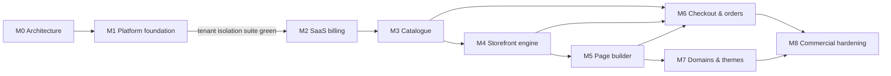

# Implementation roadmap

> Milestone 0 deliverable. Status: **approved baseline (Milestone 0, 2026-09-24)**.
> Issue-level breakdown: [github-milestones-and-issues.md](./github-milestones-and-issues.md).

## Working agreement (every task)

Define the problem → acceptance criteria → smallest complete vertical slice →
tests → lint → typecheck → tests → production build → fix → document
decisions (ADR if architectural) → coherent commits → PR with green checks.

A feature is **done** only when, where applicable: schema + migration,
server implementation, authorisation, entitlement checks, input validation,
UI with loading/empty/error states, responsive layout, accessibility, tests,
documentation, and a passing production build all exist.

## Milestones and gates



| Milestone                   | Goal                                             | Exit criteria (gate)                                                                                                                                                                                                                                                                                                                                                                                                                                                                                |
| --------------------------- | ------------------------------------------------ | --------------------------------------------------------------------------------------------------------------------------------------------------------------------------------------------------------------------------------------------------------------------------------------------------------------------------------------------------------------------------------------------------------------------------------------------------------------------------------------------------- |
| **M0 Architecture**         | Agree the architecture before building           | This document set reviewed; ADRs 0002–0019 accepted or amended; open questions Q1–Q4 answered; repo tooling scaffold and CI green                                                                                                                                                                                                                                                                                                                                                                   |
| **M1 Platform foundation**  | Sign up → organisation → store, securely         | Auth flows, organisations, memberships, invitations, RBAC, store creation, dashboard shell, platform-admin shell; **tenant-isolation suite T1–T16 green** ([03-tenancy.md §8](../architecture/03-tenancy.md#8-proof-the-tenant-isolation-test-suite-milestone-1-exit-criteria)); E2E: sign-up → create org → create store                                                                                                                                                                           |
| **M2 SaaS billing**         | Plans limit usage; subscriptions from any source | Revised by ADR-0022 (no real payment gateway yet): plans/features as data; entitlement engine with concurrency-safe limits; provider-neutral Subscription Service with a source-independent state machine; manual assignment and overrides in platform-admin (permission, step-up, reason, audit); `BillingProvider` with the mock provider and the idempotent webhook pipeline; plan enforcement on stores and staff; over-limit policy; informational merchant billing page; E2E across both apps |
| **M3 Catalogue**            | Real product data                                | Products with options and variants, collections, media library (signed uploads, sniffing, renditions), locations, inventory with movement ledger; product limit enforced; catalogue API v1 (read/write)                                                                                                                                                                                                                                                                                             |
| **M4 Storefront engine**    | Stores are visible on the web                    | Page-document schema v1 + component registry + base renderers (the `editor` package's document/render entry points, pulled forward from M5); hostname resolution, canonical redirects, status pages, home/product/collection/search/404 routes with a default theme, cart, caching + invalidation, sitemap/robots; query budget test                                                                                                                                                                |
| **M5 Page builder**         | Merchants design pages visually                  | Document migrations framework and remaining components on top of the M4 schema/registry, editor shell (dnd, layers, properties, responsive previews, undo/redo, shortcuts), Tiptap rich text, autosave with concurrency, draft/publish/restore                                                                                                                                                                                                                                                      |
| **M6 Checkout & orders**    | Stores take money                                | Checkout flow with server-side pricing, discounts, shipping, tax (manual), payment abstraction + first provider + test provider, orders with snapshots, inventory reservation/deduction, customers, refunds, fulfilments, order webhooks; **critical E2E path green** (below)                                                                                                                                                                                                                       |
| **M7 Domains & themes**     | Brand ownership                                  | Custom domains with verification + automatic TLS + primary selection; theme package format, validation, installation, customisation, preview, publish; second first-party theme                                                                                                                                                                                                                                                                                                                     |
| **M8 Commercial hardening** | Launch readiness                                 | Audit coverage, rate limiting everywhere, monitoring and alerting, external security review/pen test, performance review against budgets, backup/restore drill, data export, account/organisation deletion, billing recovery flows, support tooling in platform-admin                                                                                                                                                                                                                               |

### Critical end-to-end scenario (must pass at the end of M6)

User signs up → creates organisation → selects plan/trial → creates store →
adds product → creates page → publishes page → storefront renders → product
added to cart → checkout completes with the test payment provider → order
appears in the merchant dashboard.

## Milestone 1 status

Delivered: database infrastructure (staged first migration with RLS, roles,
grants, test and reset workflows, dev seed), authentication (Better Auth,
wrapped), organisations, memberships, invitations, RBAC, store creation,
trusted tenant context, the dashboard shell (desktop, tablet and mobile
layouts), and the security test suites in CI ([11-testing.md](../architecture/11-testing.md)).

Moved out of Milestone 1, with the reason:

| Issue                             | Now                           | Why                                                                                                                           |
| --------------------------------- | ----------------------------- | ----------------------------------------------------------------------------------------------------------------------------- |
| M1-16 Platform-admin app shell    | M2 (with M2-12 billing tools) | Realm isolation (T11) is enforced and tested in `packages/auth`. The admin UI has no read models to show until billing exists |
| M1-09 Google sign-in              | M8 (with MFA)                 | Optional; architecture unchanged                                                                                              |
| M1-21 Marketing site skeleton     | M2 (with pricing)             | Excluded from M1 by the milestone brief                                                                                       |
| `observability` package           | M2 (with the worker)          | First real consumer is the worker; M1 logs structured errors with request IDs                                                 |
| docker compose for local services | Open (see Milestone 3 status) | M1 needs only PostgreSQL (`pnpm db:setup`)                                                                                    |

## Milestone 2 status

**Complete** (tag `milestone-2`). An independent security review found no
merchant-reachable bypass or cross-tenant leak. Its findings (webhook
ordering, simulator privileges, a dedicated billing database role, stuck
provider subscriptions, and several smaller gaps) were fixed with
regression tests and recorded as ADR-0022 amendments A1–A10. All four CI
jobs were green before the tag.

Recovery points: `milestone-0` (architecture baseline), `milestone-1`
(commit `d3ccbf9`, platform foundation), `milestone-2`.

Revised before implementation: payment-gateway registration is pending, so
**no real payment gateway is integrated in Milestone 2**
([ADR-0022](../adr/0022-provider-neutral-subscriptions-and-entitlements.md)).
Manual platform-admin assignment, the mock provider and future real providers
all feed one path: Subscription Service → Entitlement Engine → Usage
Enforcement.

Delivered: billing/entitlement tables with RLS and least-privilege grants,
reference features (migration) and plans (seed); `@storevia/entitlements`
(resolution override → plan → system default, BOOLEAN/LIMIT/UNLIMITED/
CONFIGURATION, atomic usage counters, reconciliation); enforcement of
`store_count`, `staff_accounts` and `advanced_permissions`;
`@storevia/billing` (Subscription Service and state machine, manual staff
operations, overrides, `BillingProvider`, `MockBillingProvider`, webhook
pipeline, simulation, expiry sweep); `apps/platform-admin` (staff realm,
permissions, step-up, organisation subscription management, simulator);
the dashboard billing page; `@storevia/observability`; and the test suites
in [11-testing.md](../architecture/11-testing.md).

Moved out of Milestone 2, with the reason:

| Item                                                                                                       | Now                                           | Why                                                                                                                 |
| ---------------------------------------------------------------------------------------------------------- | --------------------------------------------- | ------------------------------------------------------------------------------------------------------------------- |
| Real providers (Stripe/Razorpay), checkout, billing portal, payment methods, invoices, production webhooks | Commercialisation phase                       | Explicitly deferred by the Milestone 2 revision; they arrive as `BillingProvider` adapters (Q3 decides which first) |
| M2-04 Worker and job queue                                                                                 | M3                                            | No production webhook traffic yet; the pipeline runs inline and the expiry sweep runs as `pnpm billing:sweep`       |
| Nightly usage reconciliation job                                                                           | M3 (with the worker)                          | `reconcileUsage` exists and staff can run it per organisation                                                       |
| M2-11 Pricing page and M1-21 marketing skeleton                                                            | M3                                            | Not part of the revised Milestone 2 scope; the pricing page will read the plan catalogue                            |
| Merchant self-service plan changes (upgrade/downgrade/cancel)                                              | Commercialisation phase                       | Needs a payment provider; until then plan changes are staff actions                                                 |
| Storefront behaviour per subscription status (M2-08)                                                       | M4 (storefront engine)                        | No storefront exists yet; the dashboard shows status banners                                                        |
| MFA/SSO for platform staff                                                                                 | Before platform-admin goes to production (M8) | Doc 04 §6; platform-admin must not be deployed to production before it                                              |

## Milestone 2.5 status: product experience and commercial foundation

**Built. Waiting at the design review checkpoint.** Commerce Catalogue (M3),
Products, Inventory, Orders and the Visual Builder don't start until the
owner approves the design on desktop, tablet and phone. No payment gateway,
POS or OmniPOS integration was built.

Delivered:

- **Background jobs** (ADR-0023): `packages/jobs` scheduler and
  `apps/worker`, with the subscription expiry sweep every 5 minutes and
  nightly usage reconciliation. This brings forward M2-04 and the
  reconciliation job moved out of M2.
- **Business types and role presets** (ADR-0024): store-level
  `businessType` (online store, business website, publication, portfolio)
  that drives onboarding, navigation, the store home and invitation
  suggestions. It never grants permissions or plan features. Five preset
  roles use the existing permission primitives.
- **Design system** ([12-design-system.md](../architecture/12-design-system.md)):
  tokens, Inter, the Lucide-based icon system, Storevia glyphs, and the
  data, choice and command components, with AA contrast tested.
- **Merchant dashboard**: separate desktop, tablet and phone layouts,
  navigation by business type with plan locks, a ⌘K command menu,
  contextual create actions, and business-type selection and change.
- **Marketing site** (ADR-0025): home, products, solutions, pricing from the
  plan catalogue, resources (roadmap and security), about, contact (working
  form) and legal placeholders. It runs on its own read-only database role.
  This brings forward M1-21 and M2-11.
- **Platform-admin**: internal chrome, an environment strip, a risk summary,
  confirmation-gated high-risk actions, readable entitlements and a
  read-only background jobs view.

### Design review checkpoint (how to run it)

```sh
git fetch origin claude/cool-thompson-c7u8qp && git checkout claude/cool-thompson-c7u8qp
pnpm install
cp .env.example .env            # first time only; adjust ports if needed
pnpm db:setup && pnpm db:migrate && pnpm db:seed && pnpm db:seed:dev
pnpm dev                        # marketing :3000, dashboard :3001, platform-admin :3003
```

- Marketing: <http://localhost:3000>
- Dashboard: <http://app.localhost:3001>. Sign in as `owner@acme.test`
  (online store and publication), `owner@studionorth.test` (portfolio and
  business website) or `owner@globex.test` (starter trial), with the password
  printed by `pnpm db:seed:dev`.
- Platform-admin: <http://admin.localhost:3003> as `staff@storevia.test`.

Review each surface at desktop (≥1280 px), tablet (768–1023 px, for example
an iPad in portrait) and phone (≈390 px) widths. In a desktop browser, use
the responsive mode of the developer tools.

## Milestone 3 status: commerce catalogue

**Built. Waiting at the Milestone 3 review.** Storefront (M4), Orders and
Checkout (M6) and the Visual Builder (M5) have not started. No payment
gateway or POS work was done, and no sales, orders or revenue figures exist
anywhere in the product.

Delivered ([ADR-0027](../adr/0027-commerce-catalogue-and-inventory.md)):

- **Schema**: 13 catalogue, media and inventory tables promoted with forced
  RLS, same-store composite FKs and triggers, partial unique indexes, CHECKs,
  search indexes and least-privilege grants (migrations
  `20260928000000_catalogue_inventory`, `20260929000000_collection_archive`).
- **`@storevia/commerce`**: money, handles, rich text, option/variant
  reconciliation, products, collections (manual), locations, the single
  inventory write path and ledger, product media, PostgreSQL search, bulk
  actions, CSV export and the store-home overview. Services take a
  `StoreContext` and run outside React.
- **`@storevia/media`**: S3 (SigV4, POST policies) and local storage
  adapters, magic-byte sniffing, sharp processing with metadata stripped,
  WebP renditions and the media library service.
- **Plan enforcement**: `product_limit` (not archived, organisation-wide)
  and `media_storage` (bytes) as gauges through the entitlement engine.
- **Dashboard**: products (search, filters, sort, status tabs, bulk
  actions, pagination, CSV export), the product editor, collections,
  inventory (stock, locations, history), the media library, and live
  catalogue and stock-alert cards on the store home.
- **Platform-admin**: read-only catalogue diagnostics per organisation.
- **Marketing**: catalogue, variants, inventory and media marked available;
  checkout, orders, themes and the builder stay on the roadmap.

Moved out of Milestone 3, with the reason:

| Item                                                 | Now                          | Why                                                                                       |
| ---------------------------------------------------- | ---------------------------- | ----------------------------------------------------------------------------------------- |
| M3-06 smart collection rules                         | Later (after M4)             | Manual collections cover the review scope; the `type` and `rules` columns already exist   |
| M3-09 Admin API v1 and API keys                      | M6 (with outbound webhooks)  | No external consumer before checkout; ADR-0027 §1                                         |
| M3-10 product taxonomy (`Category`)                  | M6 (with tax)                | Category matters for tax rules, which arrive with checkout                                |
| Media rename                                         | Later                        | File names are metadata only; alt text, search, reuse and delete are in                   |
| CSV import                                           | Later                        | The `CatalogueImporter` interface exists; export shipped                                  |
| Image processing in the worker                       | Later (scaling)              | In-request processing is bounded (20 MB, 40 MP); the `PROCESSING` state exists            |
| docker compose with MinIO                            | Open                         | Container registries were unreachable in the build environment; S3 signing is unit-tested |
| Purge of deleted media objects and soft-deleted rows | With the data-lifecycle jobs | [data-lifecycle.md](../database/data-lifecycle.md); nothing is hard-deleted in M3         |

### Milestone 3 review (how to run it)

```sh
git fetch origin claude/cool-thompson-c7u8qp && git checkout claude/cool-thompson-c7u8qp
pnpm install
pnpm db:migrate && pnpm db:seed && pnpm db:seed:dev   # or pnpm db:reset first for a clean start
pnpm dev
```

- `owner@acme.test` → Acme Flagship: 7 fictional products (5 active, 1
  draft, 1 archived), 12 variants, two collections, a Main location and a
  Bengaluru warehouse, generated images, one product low on stock and two
  variants out of stock. No sales.
- `owner@globex.test` → Globex Home: at a product limit of 3 (a staff
  override), so "Add product" is gone and saving a fourth is refused.
- `staff@storevia.test` → platform-admin: Acme Supplies → Catalogue.

## Milestone 1 plan (as scheduled at M0)

Order of work, each step a vertical slice with tests:

1. **Scaffold packages** `config`, `types`, `validation`, `observability`,
   `security`, `database` (Prisma 7 + first migration for the identity/tenancy
   subset of the draft schema, RLS policies, roles, `withTenant`), docker
   compose (PostgreSQL 17, Mailpit).
2. **Auth** (`packages/auth` + dashboard pages): sign-up, email verification,
   sign-in, sign-out, password reset, sessions list/revoke, rate limits,
   Argon2id, security headers/CSP.
3. **Organisations & memberships** (`packages/tenancy`): create organisation
   (creator = OWNER), switch organisation, members list, invitations
   (send/accept/revoke), role change, removal, ownership transfer.
4. **RBAC**: permission catalogue, role map, `authorize`, `storeAction`
   wrapper, generated matrix tests.
5. **Stores**: create (slug rules + reserved slugs + platform subdomain
   `StoreDomain`), settings (currency, locale, timezone, country), archive;
   store-scoped access.
6. **Dashboard shell** (`packages/ui` foundations + responsive navigation for
   desktop/tablet/mobile, empty states, skeletons).
7. **Platform-admin shell**: separate realm, `PlatformStaff` gate, read-only
   tenant/store search, audit of every access.
8. **Tenant-isolation suite T1–T16** + E2E (Playwright) for sign-up →
   organisation → store.
9. **CI**: add integration tests (PostgreSQL service), E2E job, bundle secret
   scan.

## Open questions for the Milestone 0 review

The baseline was approved without overrides, so each question proceeds with
its **default** below until the product owner decides otherwise. Q3, Q5 and
Q-S2 still need an explicit decision before the milestones that depend on
them (M2/M6, M8, first production deployment).

| #    | Question                                                                                                                               | Default if unanswered                                                                                               |
| ---- | -------------------------------------------------------------------------------------------------------------------------------------- | ------------------------------------------------------------------------------------------------------------------- |
| Q1   | Accept Better Auth instead of Auth.js (ADR-0007)?                                                                                      | Better Auth                                                                                                         |
| Q2   | Hosting: AWS + Cloudflare (ADR-0016) vs an all-in-one PaaS for the first year?                                                         | AWS + Cloudflare, portable containers                                                                               |
| Q3   | First launch market, and therefore first SaaS billing provider and first merchant payment provider (Stripe vs Razorpay for India)?     | Stripe for SaaS billing; merchant payments decided before M6                                                        |
| Q4   | Confirm domain names: `storevia.com`, `storevia.site` (storefronts), `storeviausercontent.com` (media)                                 | As written; placeholders until confirmed                                                                            |
| Q5   | Legal retention periods per jurisdiction ([data-lifecycle.md §4](../database/data-lifecycle.md#4-retention-schedule-initial-proposal)) | Proposed defaults                                                                                                   |
| Q6   | Trial length, and whether a trial requires a payment method                                                                            | 14 days, no card                                                                                                    |
| Q7   | Plan catalogue and limits                                                                                                              | Starter / Business / Enterprise example in [05-billing-entitlements.md](../architecture/05-billing-entitlements.md) |
| Q8   | Should trial storefronts show a "powered by / trial" banner or password page?                                                          | No banner; trial stores can go live                                                                                 |
| Q-S1 | WAF / edge vendor (affects rate limiting and custom hostnames)                                                                         | Cloudflare                                                                                                          |
| Q-S2 | Data residency requirements for launch markets (India DPDP cross-border rules)                                                         | Host in the launch market's region                                                                                  |
| Q-S3 | Identity provider for platform staff SSO                                                                                               | Decide before platform-admin reaches production (M8)                                                                |
| Q-S4 | External penetration test before public launch                                                                                         | Yes, at the end of M8                                                                                               |

## Later milestones (not planned in detail)

Advanced analytics, email marketing, abandoned checkout recovery, advanced
discounts (BOGO, tiers), customer accounts, theme marketplace, app
marketplace (OAuth apps), POS, AI website generation, AI product
descriptions, multi-language stores, multi-currency/markets, B2B commerce.
The boundaries that let these be added cleanly are described in the
architecture documents (e.g. `appInstallationId` hooks, price lists,
`Customer` realm, `SearchIndex` interface).
