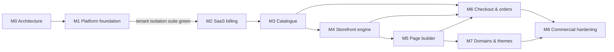

# Implementation roadmap

> Milestone 0 deliverable. Status: **approved baseline (Milestone 0, 2026-09-24)**.
> Issue-level breakdown: [github-milestones-and-issues.md](./github-milestones-and-issues.md).

## Working agreement (every task)

Define the problem → acceptance criteria → smallest complete vertical slice →
tests → lint → typecheck → tests → production build → fix → document
decisions (ADR if architectural) → coherent commits → PR with green checks.

A feature is **done** only when, where applicable: schema + migration,
server implementation, authorisation, entitlement checks, input validation,
UI with loading/empty/error states, responsive layout, accessibility, tests,
documentation, and a passing production build all exist.

## Milestones and gates

| Milestone                   | Goal                                      | Exit criteria (gate)                                                                                                                                                                                                                                                                                                                 |
| --------------------------- | ----------------------------------------- | ------------------------------------------------------------------------------------------------------------------------------------------------------------------------------------------------------------------------------------------------------------------------------------------------------------------------------------ |
| **M0 Architecture**         | Agree the architecture before building    | This document set reviewed; ADRs 0002–0019 accepted or amended; open questions Q1–Q4 answered; repo tooling scaffold and CI green                                                                                                                                                                                                    |
| **M1 Platform foundation**  | Sign up → organisation → store, securely  | Auth flows, organisations, memberships, invitations, RBAC, store creation, dashboard shell, platform-admin shell; **tenant-isolation suite T1–T16 green** ([03-tenancy.md §8](../architecture/03-tenancy.md#8-proof-the-tenant-isolation-test-suite-milestone-1-exit-criteria)); E2E: sign-up → create org → create store            |
| **M2 SaaS billing**         | Merchants pay Storevia; plans limit usage | Plans/features seeded; entitlement API with concurrency-safe limits; Stripe checkout, portal and webhooks (idempotent, retry-safe); lifecycle behaviour; plan enforcement on store and staff creation; E2E with Stripe test mode                                                                                                     |
| **M3 Catalogue**            | Real product data                         | Products with options and variants, collections, media library (signed uploads, sniffing, renditions), locations, inventory with movement ledger; product limit enforced; catalogue API v1 (read/write)                                                                                                                              |
| **M4 Storefront engine**    | Stores are visible on the web             | Page-document schema v1 + component registry + base renderers (the `editor` package's document/render entry points, pulled forward from M5); hostname resolution, canonical redirects, status pages, home/product/collection/search/404 routes with a default theme, cart, caching + invalidation, sitemap/robots; query budget test |
| **M5 Page builder**         | Merchants design pages visually           | Document migrations framework and remaining components on top of the M4 schema/registry, editor shell (dnd, layers, properties, responsive previews, undo/redo, shortcuts), Tiptap rich text, autosave with concurrency, draft/publish/restore                                                                                       |
| **M6 Checkout & orders**    | Stores take money                         | Checkout flow with server-side pricing, discounts, shipping, tax (manual), payment abstraction + first provider + test provider, orders with snapshots, inventory reservation/deduction, customers, refunds, fulfilments, order webhooks; **critical E2E path green** (below)                                                        |
| **M7 Domains & themes**     | Brand ownership                           | Custom domains with verification + automatic TLS + primary selection; theme package format, validation, installation, customisation, preview, publish; second first-party theme                                                                                                                                                      |
| **M8 Commercial hardening** | Launch readiness                          | Audit coverage, rate limiting everywhere, monitoring and alerting, external security review/pen test, performance review against budgets, backup/restore drill, data export, account/organisation deletion, billing recovery flows, support tooling in platform-admin                                                                |

### Critical end-to-end scenario (must pass at the end of M6)

User signs up → creates organisation → selects plan/trial → creates store →
adds product → creates page → publishes page → storefront renders → product
added to cart → checkout completes with the test payment provider → order
appears in the merchant dashboard.

## Milestone 1 status

Delivered: database infrastructure (staged first migration with RLS, roles,
grants, test and reset workflows, dev seed), authentication (Better Auth,
wrapped), organisations, memberships, invitations, RBAC, store creation,
trusted tenant context, the dashboard shell (desktop, tablet and mobile
layouts), and the security test suites in CI ([11-testing.md](../architecture/11-testing.md)).

Moved out of Milestone 1, with the reason:

| Issue                             | Now                           | Why                                                                                                                           |
| --------------------------------- | ----------------------------- | ----------------------------------------------------------------------------------------------------------------------------- |
| M1-16 Platform-admin app shell    | M2 (with M2-12 billing tools) | Realm isolation (T11) is enforced and tested in `packages/auth`. The admin UI has no read models to show until billing exists |
| M1-09 Google sign-in              | M8 (with MFA)                 | Optional; architecture unchanged                                                                                              |
| M1-21 Marketing site skeleton     | M2 (with pricing)             | Excluded from M1 by the milestone brief                                                                                       |
| `observability` package           | M2 (with the worker)          | First real consumer is the worker; M1 logs structured errors with request IDs                                                 |
| docker compose for local services | M3 (with MinIO)               | M1 needs only PostgreSQL (`pnpm db:setup`)                                                                                    |

## Milestone 1 plan (as scheduled at M0)

Order of work, each step a vertical slice with tests:

1. **Scaffold packages** `config`, `types`, `validation`, `observability`,
   `security`, `database` (Prisma 7 + first migration for the identity/tenancy
   subset of the draft schema, RLS policies, roles, `withTenant`), docker
   compose (PostgreSQL 17, Mailpit).
2. **Auth** (`packages/auth` + dashboard pages): sign-up, email verification,
   sign-in, sign-out, password reset, sessions list/revoke, rate limits,
   Argon2id, security headers/CSP.
3. **Organisations & memberships** (`packages/tenancy`): create organisation
   (creator = OWNER), switch organisation, members list, invitations
   (send/accept/revoke), role change, removal, ownership transfer.
4. **RBAC**: permission catalogue, role map, `authorize`, `storeAction`
   wrapper, generated matrix tests.
5. **Stores**: create (slug rules + reserved slugs + platform subdomain
   `StoreDomain`), settings (currency, locale, timezone, country), archive;
   store-scoped access.
6. **Dashboard shell** (`packages/ui` foundations + responsive navigation for
   desktop/tablet/mobile, empty states, skeletons).
7. **Platform-admin shell**: separate realm, `PlatformStaff` gate, read-only
   tenant/store search, audit of every access.
8. **Tenant-isolation suite T1–T16** + E2E (Playwright) for sign-up →
   organisation → store.
9. **CI**: add integration tests (PostgreSQL service), E2E job, bundle secret
   scan.

## Open questions for the Milestone 0 review

The baseline was approved without overrides, so each question proceeds with
its **default** below until the product owner decides otherwise. Q3, Q5 and
Q-S2 still need an explicit decision before the milestones that depend on
them (M2/M6, M8, first production deployment).

| #    | Question                                                                                                                               | Default if unanswered                                                                                               |
| ---- | -------------------------------------------------------------------------------------------------------------------------------------- | ------------------------------------------------------------------------------------------------------------------- |
| Q1   | Accept Better Auth instead of Auth.js (ADR-0007)?                                                                                      | Better Auth                                                                                                         |
| Q2   | Hosting: AWS + Cloudflare (ADR-0016) vs an all-in-one PaaS for the first year?                                                         | AWS + Cloudflare, portable containers                                                                               |
| Q3   | First launch market, and therefore first SaaS billing provider and first merchant payment provider (Stripe vs Razorpay for India)?     | Stripe for SaaS billing; merchant payments decided before M6                                                        |
| Q4   | Confirm domain names: `storevia.com`, `storevia.site` (storefronts), `storeviausercontent.com` (media)                                 | As written; placeholders until confirmed                                                                            |
| Q5   | Legal retention periods per jurisdiction ([data-lifecycle.md §4](../database/data-lifecycle.md#4-retention-schedule-initial-proposal)) | Proposed defaults                                                                                                   |
| Q6   | Trial length, and whether a trial requires a payment method                                                                            | 14 days, no card                                                                                                    |
| Q7   | Plan catalogue and limits                                                                                                              | Starter / Business / Enterprise example in [05-billing-entitlements.md](../architecture/05-billing-entitlements.md) |
| Q8   | Should trial storefronts show a "powered by / trial" banner or password page?                                                          | No banner; trial stores can go live                                                                                 |
| Q-S1 | WAF / edge vendor (affects rate limiting and custom hostnames)                                                                         | Cloudflare                                                                                                          |
| Q-S2 | Data residency requirements for launch markets (India DPDP cross-border rules)                                                         | Host in the launch market's region                                                                                  |
| Q-S3 | Identity provider for platform staff SSO                                                                                               | Decide before platform-admin reaches production (M8)                                                                |
| Q-S4 | External penetration test before public launch                                                                                         | Yes, at the end of M8                                                                                               |

## Later milestones (not planned in detail)

Advanced analytics, email marketing, abandoned checkout recovery, advanced
discounts (BOGO, tiers), customer accounts, theme marketplace, app
marketplace (OAuth apps), POS, AI website generation, AI product
descriptions, multi-language stores, multi-currency/markets, B2B commerce.
The boundaries that let these be added cleanly are described in the
architecture documents (e.g. `appInstallationId` hooks, price lists,
`Customer` realm, `SearchIndex` interface).
