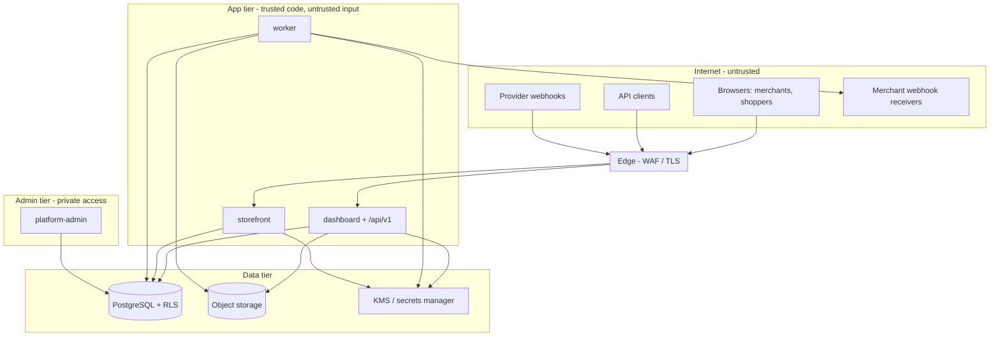

# Security threat model

> Milestone 0 deliverable. Status: **approved baseline (Milestone 0, 2026-09-24)**.
> Revisited at the start of every milestone and before launch (M8 security
> review). Reporting vulnerabilities: [SECURITY.md](../../SECURITY.md).

## 1. Assets

| Asset                                                            | Why it matters                                       |
| ---------------------------------------------------------------- | ---------------------------------------------------- |
| Tenant business data (products, orders, customers, content)      | Confidentiality between tenants; merchant trust      |
| Shopper PII (names, emails, addresses, phone)                    | Privacy law (DPDP, GDPR); breach notification duties |
| Credentials: user passwords, sessions, API keys, webhook secrets | Account takeover                                     |
| Merchant payment-provider connections                            | Financial fraud (redirecting payouts, refunds)       |
| Storevia billing state and entitlements                          | Revenue; bypassing limits                            |
| Platform-admin capabilities                                      | Cross-tenant control; highest impact                 |
| Published storefronts                                            | Availability and integrity (defacement, skimming)    |
| Infrastructure secrets (DB, KMS, provider keys)                  | Full compromise                                      |

## 2. Actors

Anonymous internet users and bots · shoppers · merchant members (each role),
including a **malicious tenant** probing other tenants · a compromised member
account · third-party integrations holding API keys · payment/billing
providers (webhook senders) · Storevia staff (including an insider) ·
supply-chain (dependencies, CI).

## 3. Trust boundaries

Every arrow crossing into B2 carries untrusted input. Tenant identity is
established **inside B2** from credentials, never taken from input.

## 4. Threats and mitigations

Legend: **M** = milestone in which the control lands. **Test** = how it is
verified.

### 4.1 Cross-tenant access and IDOR (critical)

| Threat                                                                 | Mitigation                                                                                                                 | Test                                                        | M   |
| ---------------------------------------------------------------------- | -------------------------------------------------------------------------------------------------------------------------- | ----------------------------------------------------------- | --- |
| User of Org A reads/modifies Org B data by changing IDs in URLs/bodies | Server-built `TenantContext`; `authorize`; tenant predicates on every query; RLS; composite FKs; 404 for foreign resources | T1–T16 in [03-tenancy.md](../architecture/03-tenancy.md) §8 | 1   |
| Enumeration of stores/orders via sequential IDs                        | UUIDv7/TypeIDs; 404 non-disclosure; rate limits                                                                            | enumeration tests                                           | 1   |
| Cross-store linking inside one organisation (store-scoped member)      | `MembershipStoreAccess`; composite FKs `(id, storeId)`                                                                     | T8, T14                                                     | 1   |
| Tenant data leaking through caches                                     | Tenant-prefixed cache keys/tags; `private, no-store` on dashboard                                                          | cache-key unit tests; header tests                          | 4   |
| Search results across tenants                                          | `SearchIndex` implementation always filters by store                                                                       | search integration test                                     | 3   |
| Worker job acting on the wrong tenant                                  | Tenant IDs in payload set server-side; `systemContext` + RLS                                                               | job tests                                                   | 2   |

### 4.2 Authentication and sessions

| Threat                                            | Mitigation                                                                                                                                                                   | Test                                                   | M   |
| ------------------------------------------------- | ---------------------------------------------------------------------------------------------------------------------------------------------------------------------------- | ------------------------------------------------------ | --- |
| Credential stuffing / brute force                 | Per-IP (trusted edge header, required in staging/production; right-most hop) and per-account rate limits, progressive challenge (M8), breached-password check, WAF bot rules | rate-limit tests                                       | 1   |
| Password DB leak                                  | Argon2id; sessions and tokens stored as hashes                                                                                                                               | unit tests on storage format                           | 1   |
| Session fixation                                  | New token on sign-in/privilege change                                                                                                                                        | test that the pre-login token is not valid after login | 1   |
| Session theft via XSS                             | `HttpOnly` `__Host-` cookies, CSP, output encoding                                                                                                                           | header tests, CSP report monitoring                    | 1   |
| Reset/verification token abuse                    | 256-bit single-use hashed tokens, short TTL, issuance rate limits, sessions revoked on reset                                                                                 | token lifecycle tests                                  | 1   |
| Account enumeration                               | Uniform responses/timing                                                                                                                                                     | response-equality tests                                | 1   |
| OAuth account takeover (unverified email linking) | Link only verified matching emails; PKCE/state/nonce                                                                                                                         | OAuth callback tests                                   | 1   |
| Stolen session used for sensitive actions         | Step-up re-auth for billing/ownership/domains/API keys                                                                                                                       | tests on each sensitive action                         | 1–2 |

### 4.3 Authorisation and privilege escalation

| Threat                                         | Mitigation                                                                                                                                                          | Test                                                                   | M    |
| ---------------------------------------------- | ------------------------------------------------------------------------------------------------------------------------------------------------------------------- | ---------------------------------------------------------------------- | ---- |
| Member grants themselves a higher role         | Subset rule; no self-role-change; single OWNER invariant                                                                                                            | T7                                                                     | 1    |
| Plan bypass (use features not paid for)        | Server-side `assertFeature`/`consumeUsage` with row locks                                                                                                           | concurrency + gating tests                                             | 2    |
| Merchant assigns or upgrades their own plan    | No merchant-facing plan API; app DB role cannot write subscriptions, events or overrides; plan changes only in platform-admin (ADR-0022)                            | DB grant tests; crafted replay of a staff action with merchant cookies | 2    |
| Forged or replayed billing webhook             | HMAC over the raw body, 5-minute timestamp window, unique event ledger, per-subscription lock, stale-snapshot guard                                                 | pipeline tests (invalid/stale signature, duplicate, out-of-order)      | 2    |
| Mock billing reachable in production           | Registry enables the mock only in development/test or staging with a flag; route, provider and simulator 404 elsewhere; unset stage fails closed                    | environment-safety tests                                               | 2    |
| Staff changes a plan by mistake or maliciously | Platform permission per role, step-up, required reason, audit (before/after, request ID), SubscriptionEvent history, over-limit acknowledgement; never deletes data | platform permission matrix, audit and step-up tests                    | 2    |
| Merchant reaches platform-admin                | Separate host, realm, cookie, `PlatformStaff` check, private access                                                                                                 | T11                                                                    | 1    |
| Insider misuse of platform-admin               | Least-privilege platform roles, MFA/SSO, full audit, no silent impersonation, alerts on sensitive actions                                                           | audit coverage test                                                    | 1, 8 |
| API key over-privilege                         | Store-bound keys, scopes → permissions, entitlement check                                                                                                           | scope matrix tests                                                     | 3    |

### 4.4 Injection and content attacks

| Threat                                              | Mitigation                                                                                                                                          | Test                                                           | M    |
| --------------------------------------------------- | --------------------------------------------------------------------------------------------------------------------------------------------------- | -------------------------------------------------------------- | ---- |
| SQL injection                                       | Prisma parameterised queries; raw SQL only via tagged templates (`$queryRaw\`\``), `$queryRawUnsafe` banned by lint                                 | lint rule; review                                              | 1    |
| Stored XSS via product descriptions / page content  | Rich text stored as JSON and rendered through an allow-list; no raw HTML props; React escaping; sanitiser on derived HTML                           | XSS payload corpus tests                                       | 3, 5 |
| XSS via CustomHTML                                  | Sanitised by default; scripts only in a sandboxed opaque-origin iframe (entitlement-gated)                                                          | sandbox tests                                                  | 5    |
| CSS injection                                       | Constrained style vocabulary, no free-form CSS; theme CSS validated                                                                                 | schema tests                                                   | 5, 7 |
| CSRF                                                | SameSite cookies, Server Action origin checks, Origin checks on cookie routes, token-only API                                                       | CSRF tests                                                     | 1    |
| Open redirect                                       | Relative-path validator that checks the **normalised** path (dot-segment and backslash bypasses tested); canonical redirects only to DB hosts       | redirect tests                                                 | 1, 4 |
| SSRF (webhooks, domain checks, remote media import) | `safeFetch`: https only, DNS resolved and pinned, private/loopback/link-local/metadata ranges blocked, no redirects, size/time limits, egress proxy | SSRF test matrix (IPv4/IPv6, DNS rebinding, decimal/octal IPs) | 2–4  |
| Path traversal                                      | Storage keys server-generated from IDs; filenames never used in paths; theme package paths normalised and confined                                  | traversal tests                                                | 3, 7 |
| Unsafe HTML emails                                  | Email templates are React-email components with escaped data                                                                                        | template tests                                                 | 1    |

### 4.5 Files and media

| Threat                                             | Mitigation                                                                                                                                                                                                                                    | Test                | M   |
| -------------------------------------------------- | --------------------------------------------------------------------------------------------------------------------------------------------------------------------------------------------------------------------------------------------- | ------------------- | --- |
| Malicious upload (HTML/SVG with script, polyglots) | Signed uploads with size + type constraints; server-side magic-byte sniffing; allow-listed types; SVG sanitised or rasterised; served from a separate user-content domain with `Content-Disposition` and `X-Content-Type-Options: nosniff`    | upload corpus tests | 3   |
| Storage exhaustion / cost abuse                    | Per-organisation storage quota (`media_storage` entitlement); upload targets bound to the declared size; at most 20 pending uploads per store per hour; raw uploads under a never-served, expiring prefix; deleting media deletes its objects | quota tests         | 3   |
| Image-processing exploits (decompression bombs)    | Pixel-count limits; processing in the worker with memory/time limits                                                                                                                                                                          | bomb fixtures       | 3   |

### 4.6 Webhooks and payments

| Threat                            | Mitigation                                                                                                | Test                                       | M    |
| --------------------------------- | --------------------------------------------------------------------------------------------------------- | ------------------------------------------ | ---- |
| Spoofed billing/payment webhooks  | Signature verification on raw body, timestamp tolerance, re-fetch object from provider                    | invalid-signature tests                    | 2, 6 |
| Replay / duplicate webhook        | Unique event ledger; idempotent handlers                                                                  | duplicate delivery tests                   | 2, 6 |
| Price tampering at checkout       | Server-side pricing only; quote hash; re-validation before payment                                        | tampered-request tests                     | 6    |
| Double charge / double refund     | Idempotency keys on payments and refunds; unique constraints                                              | race tests                                 | 6    |
| Discount-limit races              | Row-locked redemption check at order creation                                                             | concurrency tests                          | 6    |
| Merchant payment credential theft | OAuth/Connect linking preferred; envelope encryption with KMS; decrypt only in payment path; never logged | secret-handling tests; log redaction tests | 6    |
| Card data exposure                | Hosted fields/pages only (PCI SAQ-A)                                                                      | architecture review                        | 6    |

### 4.7 Domains and storefronts

| Threat                                          | Mitigation                                                                                                         | Test                                                                                                                                       | M   |
| ----------------------------------------------- | ------------------------------------------------------------------------------------------------------------------ | ------------------------------------------------------------------------------------------------------------------------------------------ | --- |
| Domain hijack (claiming someone else's domain)  | TXT verification token per store; periodic re-verification; domain unique globally                                 | verification tests                                                                                                                         | 7   |
| Dangling DNS / subdomain takeover after removal | On removal, remove edge custom-hostname immediately; re-verification before re-activation                          | lifecycle tests                                                                                                                            | 7   |
| Cookie tossing between stores                   | `storevia.site` on the Public Suffix List; host-only `__Host-` cookies                                             | E2E: cart cookie is host-only, `HttpOnly`, `SameSite=Lax`; PSL checklist (`docs/deployment/public-suffix-list.md`), **not yet submitted**  | 4 ✔ |
| Phishing using reserved or look-alike slugs     | Reserved-slug list, confusable/homoglyph checks, abuse reporting and suspension                                    | slug tests                                                                                                                                 | 1   |
| Host header injection / cache poisoning         | Edge accepts only known hostnames; the app never builds absolute URLs from unvalidated Host; cache keys normalised | domains unit (normalisation); redirects and canonical URLs come from `StoreDomain` rows only; E2E: unknown host → 404, `/sv/{other}` → 404 | 4 ✔ |

Milestone 4 adds these storefront rows:

| Threat                                                       | Mitigation                                                                                                                                               | Test                                                                | M   |
| ------------------------------------------------------------ | -------------------------------------------------------------------------------------------------------------------------------------------------------- | ------------------------------------------------------------------- | --- |
| A storefront bug reads drafts, costs or another store        | `storevia_storefront` role: restrictive sellable-only policies, column grants, store scope required, host resolution through one narrow definer function | database `storefront.int.test.ts` + mutation checks (11-testing.md) | 4 ✔ |
| Choosing the store from the request (path, header, cookie)   | the proxy rewrites every path under the resolved store and signs the context; the layout refuses an unsigned or stale header                             | storefront unit (signed header); E2E `/sv/{other}` → 404            | 4 ✔ |
| Forged cache invalidation (stale content or cache flushing)  | HMAC over timestamp and body, 5-minute window, well-formed tags only; private address                                                                    | storefront unit `revalidate/route.test.ts` + mutation checks        | 4 ✔ |
| Preview link reuse on another store, or leaking via referrer | store-bound 15-minute HMAC token; moved into a host-only cookie and removed from the URL with `Referrer-Policy: no-referrer`                             | domains unit; E2E preview flow                                      | 4 ✔ |
| Cart price tampering or cross-store carts                    | carts hold no prices; server-side pricing; variants validated against the store; token hashed at rest                                                    | commerce `storefront.int.test.ts`; E2E cart                         | 4 ✔ |
| An old store address taken over by another store             | `StoreSlugHistory`: a retired slug can never be claimed by another store; the old host keeps redirecting                                                 | database and tenancy slug history tests; E2E address change         | 4 ✔ |

### 4.8 Availability and abuse

| Threat                              | Mitigation                                                                                          | M    |
| ----------------------------------- | --------------------------------------------------------------------------------------------------- | ---- |
| Rate abuse / scraping / DoS         | Edge WAF + rate limiting; app-level limits per IP/user/key/store; bounded queries and payloads      | 1, 8 |
| Noisy neighbour                     | Per-tenant quotas; storefront caching; query budgets (M4: ≤ 8 queries per render, enforced by test) | 4, 8 |
| Expensive builder documents         | Node/depth/size/data-binding limits in `validateDocument` (M4, editor tests)                        | 4    |
| Fraudulent stores (phishing, scams) | Abuse reporting, platform-admin review and suspension, signup risk checks                           | 8    |

### 4.9 Secrets and supply chain

| Threat                           | Mitigation                                                                                                                                       | M    |
| -------------------------------- | ------------------------------------------------------------------------------------------------------------------------------------------------ | ---- |
| Secrets in the repo              | `.gitignore`, gitleaks in CI, GitHub secret scanning + push protection, `.env.example` only                                                      | 0    |
| Secrets in browser bundles       | Only zod-validated `NEXT_PUBLIC_*` vars reach the client; `server-only` imports; bundle scan in CI                                               | 1    |
| Secrets in logs                  | Logger redaction allow-list; audit metadata allow-list                                                                                           | 1    |
| Malicious/compromised dependency | Pinned versions + lockfile, `pnpm` strict, Dependabot/Renovate with review, `pnpm audit` in CI, minimal dependencies, provenance where available | 0    |
| CI compromise                    | Least-privilege `GITHUB_TOKEN`, pinned action SHAs, no secrets for fork PRs, OIDC to cloud (no long-lived keys)                                  | 0, 8 |

## 5. Security headers (all web apps)

`Strict-Transport-Security: max-age=63072000; includeSubDomains; preload` on
Storevia-owned domains (`storevia.com`, `storevia.site`,
`storeviausercontent.com`). Merchant custom domains get
`max-age=31536000` **without** `includeSubDomains`/`preload`, because
those would force HTTPS onto the merchant's other subdomains ·
`Content-Security-Policy` with per-request nonces, `default-src 'self'`,
`frame-ancestors 'none'` (dashboard/admin), `object-src 'none'`,
`base-uri 'none'` · `X-Content-Type-Options: nosniff` ·
`Referrer-Policy: strict-origin-when-cross-origin` · `Permissions-Policy`
restrictive defaults · `Cross-Origin-Opener-Policy: same-origin`.
Storefront CSP additionally allows the configured payment provider origins
on checkout only.

## 6. Open security questions (tracked in the roadmap)

- Q-S1: WAF/edge vendor choice (affects rate-limiting and custom-hostname
  implementation).
- Q-S2: Data residency requirements for launch markets (India DPDP rules on
  cross-border transfer).
- Q-S3: Platform staff IdP (Google Workspace vs Okta/Entra).
- Q-S4: Penetration test before public launch (recommended: external test
  at end of M8).
